# Arquitetura TRBA: Baseline vs. Modificações (Atenção 2D + Branch Contrastiva)

> Documento visual descrevendo a arquitetura **atual implementada** no repositório
> [`constrastive-deep-text-recognition-benchmark`](file:///home/andre/dev/research/constrastive-deep-text-recognition-benchmark).

---

## 1. Visão Geral de Alto Nível

O sistema possui **três configurações** possíveis, todas construídas sobre o mesmo backbone modular de 4 estágios:

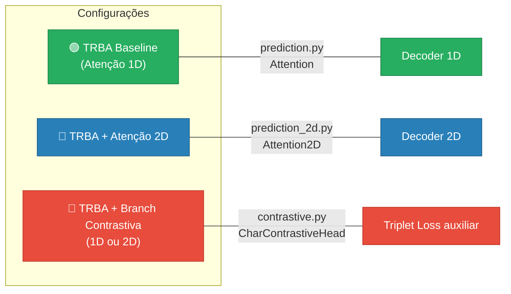

| Configuração | `--attention_type` | `--use_contrastive` | Módulos adicionais |
|---|---|---|---|
| 🟢 Baseline TRBA | `1D` (default) | `False` | Nenhum |
| 🔵 Atenção 2D | `2D` | `False` | `Attention2D`, `LearnablePositionalEncoding2D` |
| 🔴 + Contrastiva | `1D` ou `2D` | `True` | `CharContrastiveHead`, `ContrastiveLoss` |

---

## 2. Arquitetura Baseline — TRBA (Atenção 1D)

O pipeline clássico de 4 estágios: **T**PS → **R**esNet → **B**iLSTM → **A**ttn.

### 2.1 Pipeline Completo (1D)

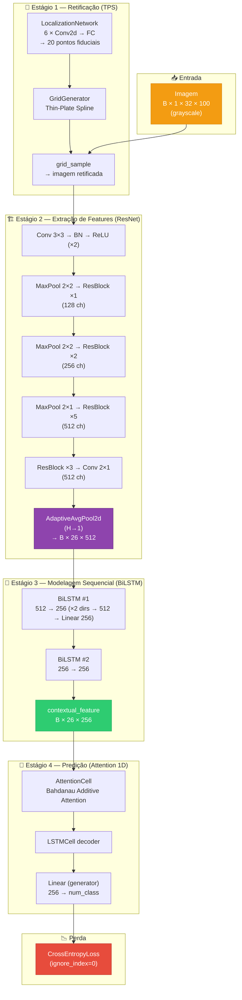

### 2.2 Detalhe — Mecanismo de Atenção 1D (Bahdanau)

O decoder autoregressivo atende a **26 posições** (colunas) da sequência de features. A cada passo $t$:

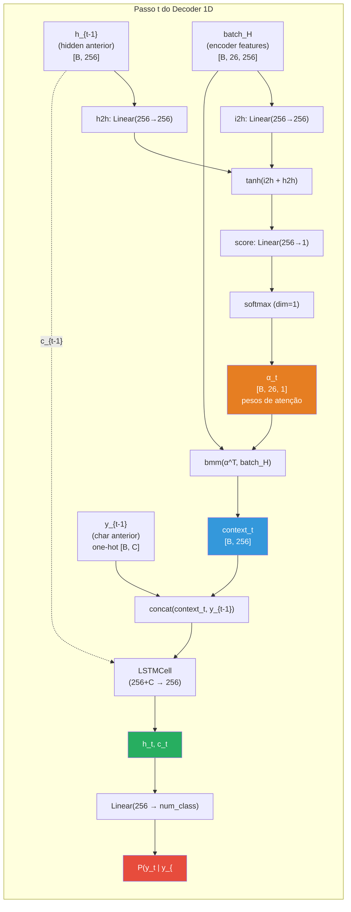

> [!NOTE]
> **Limitação da Atenção 1D**: O feature map do ResNet é colapsado de `[B, 512, H', W']` para `[B, W', 512]` via `AdaptiveAvgPool2d(H→1)`.
> Toda informação vertical é **perdida**. Para imagens com texto em múltiplas linhas (ex.: placas de moto com 2 linhas), o modelo não consegue distinguir as posições verticais.

### 2.3 Tensores: Dimensões ao Longo do Pipeline (1D)

```mermaid
graph LR
    A["B×1×32×100"] -->|TPS| B["B×1×32×100"]
    B -->|ResNet| C["B×512×1×26"]
    C -->|AvgPool+perm| D["B×26×512"]
    D -->|BiLSTM×2| E["B×26×256"]
    E -->|Attention| F["B×T×num_class"]
    F -->|CE Loss| G["scalar"]

    style A fill:#f1c40f,color:#000
    style C fill:#9b59b6,color:#fff
    style D fill:#9b59b6,color:#fff
    style E fill:#2ecc71,color:#fff
    style F fill:#e74c3c,color:#fff
```

> Para `imgH=32`: o ResNet produz `H'=1, W'=26`, resultando em **26 posições** de atenção.

---

## 3. Modificação 1 — Atenção 2D (`--attention_type 2D`)

### 3.1 Motivação

Placas brasileiras de **motocicleta** possuem layout em **duas linhas** (ex.: `ABC` na linha superior, `1D23` na inferior). Com atenção 1D, a informação vertical é colapsada, impedindo o modelo de distinguir caracteres de linhas diferentes.

A atenção 2D **preserva a grade espacial** `H'×W'` do feature map, permitindo que o decoder atenda a qualquer posição `(y, x)` da grade.

### 3.2 Pipeline Completo (2D)

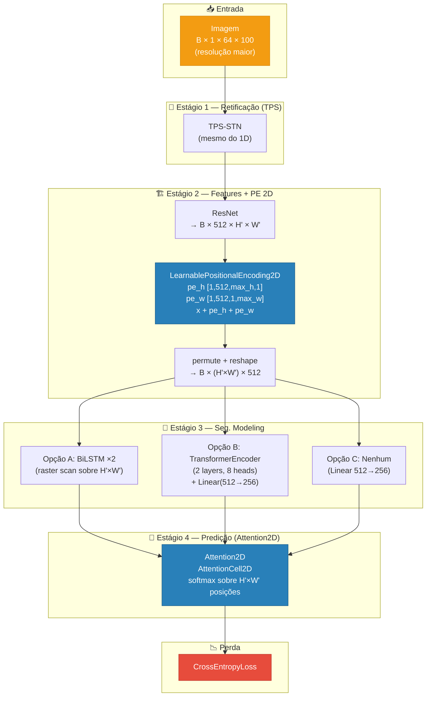

### 3.3 Diferenças Chave: 1D vs. 2D

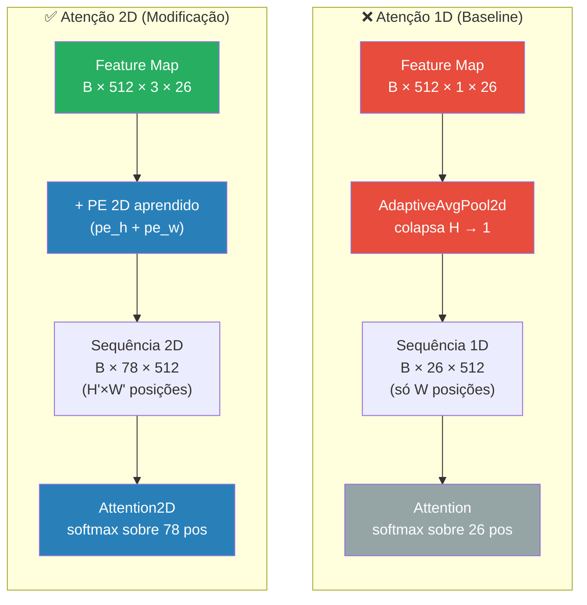

| Aspecto | Atenção 1D | Atenção 2D |
|---|---|---|
| Feature map | `[B, 512, 1, W']` (H colapsado) | `[B, 512, H', W']` (H preservado) |
| Posições de atenção | `W'` = 26 | `H'×W'` = 78 (para `imgH=64`) |
| Positional Encoding | Implícito (ordem das colunas) | `LearnablePositionalEncoding2D` (pe_h + pe_w) |
| Pool espacial | `AdaptiveAvgPool2d(H→1)` | Nenhum (flatten direto) |
| Decoder | `Attention` ([prediction.py](file:///home/andre/dev/research/constrastive-deep-text-recognition-benchmark/modules/prediction.py)) | `Attention2D` ([prediction_2d.py](file:///home/andre/dev/research/constrastive-deep-text-recognition-benchmark/modules/prediction_2d.py)) |
| Adequado para | Texto em 1 linha | Texto em **múltiplas linhas** |

### 3.4 Positional Encoding 2D Aprendido

O módulo [`LearnablePositionalEncoding2D`](file:///home/andre/dev/research/constrastive-deep-text-recognition-benchmark/modules/positional_encoding.py#L15-L57) decompõe a posição 2D em dois embeddings independentes, somados ao feature map:

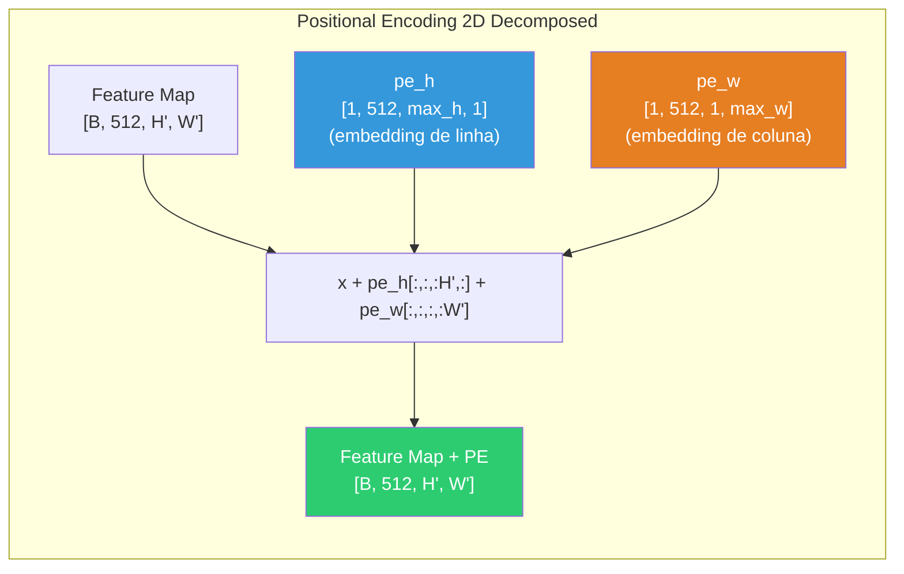

> [!TIP]
> A decomposição `pe_h + pe_w` tem muito menos parâmetros que um embedding para cada posição `(h, w)` individualmente (`max_h×C + max_w×C` vs. `max_h×max_w×C`), mas preserva a capacidade de discriminar posições espaciais.

### 3.5 Mapa de Atenção 2D — Visualização Conceitual

Enquanto na atenção 1D os pesos α formam um vetor sobre W' colunas, na atenção 2D eles formam uma **grade** sobre H'×W' posições:

```mermaid
block-beta
    columns 8

    block:header:8
        columns 8
        h0[""] h1["W₁"] h2["W₂"] h3["W₃"] h4["..."] h5["W₂₄"] h6["W₂₅"] h7["W₂₆"]
    end

    block:row1:8
        columns 8
        r1h["H₁"]
        r1c1["0.01"]
        r1c2["0.02"]
        r1c3["0.85"]
        r1c4["..."]
        r1c5["0.01"]
        r1c6["0.00"]
        r1c7["0.00"]
    end

    block:row2:8
        columns 8
        r2h["H₂"]
        r2c1["0.00"]
        r2c2["0.01"]
        r2c3["0.05"]
        r2c4["..."]
        r2c5["0.00"]
        r2c6["0.00"]
        r2c7["0.00"]
    end

    block:row3:8
        columns 8
        r3h["H₃"]
        r3c1["0.00"]
        r3c2["0.01"]
        r3c3["0.03"]
        r3c4["..."]
        r3c5["0.00"]
        r3c6["0.00"]
        r3c7["0.00"]
    end

    style r1c3 fill:#e74c3c,color:#fff
    style r1c2 fill:#e67e22,color:#fff
    style r2c3 fill:#f39c12,color:#fff
```

> O decoder pode "olhar" para posições em qualquer linha/coluna da grade, essencial para placas de moto com texto em 2 linhas.

---

## 4. Modificação 2 — Branch Contrastiva (Triplet Loss)

### 4.1 Motivação

O OCR padrão (CrossEntropy) trata cada classe como independente — não existe pressão explícita para **separar** caracteres visualmente semelhantes no espaço de features. A branch contrastiva adiciona uma penalidade que:

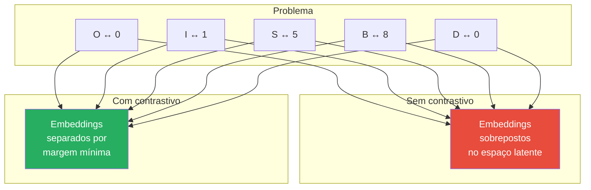

### 4.2 Arquitetura Completa com Branch Contrastiva

Este é o diagrama da arquitetura **mais completa** — TRBA com atenção (1D ou 2D) **mais** a branch contrastiva auxiliar:

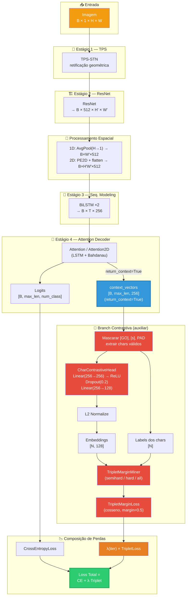

### 4.3 Detalhe — O que são os `context_vectors`?

A branch contrastiva opera sobre os **vetores de contexto** ($c_t$) produzidos pelo mecanismo de atenção a cada passo do decoder. Estes vetores são a **média ponderada** do feature map, guiada pelos pesos de atenção $α_t$:

$$c_t = \sum_{i} α_{t,i} \cdot h_i$$

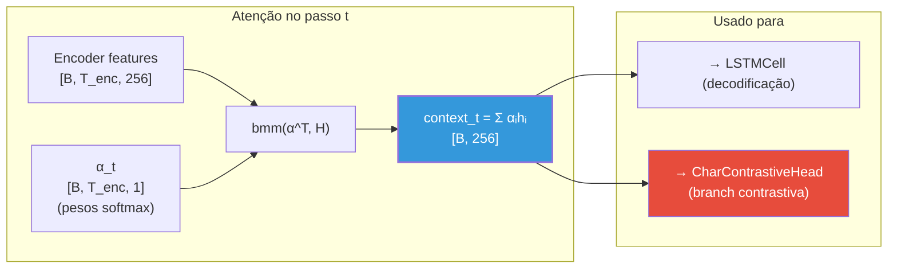

> [!IMPORTANT]
> Os `context_vectors` (e não os hidden states `h_t`) foram escolhidos como entrada da branch contrastiva porque representam a **informação visual** agregada pela atenção para cada caractere, sendo mais diretamente ligados à aparência visual do que os hidden states, que misturam informação visual com contexto sequencial.

### 4.4 Detalhe — Mineração de Trincas e Perda Triplet

Para cada batch, o `TripletMarginMiner` seleciona trincas (âncora, positivo, negativo) automaticamente:

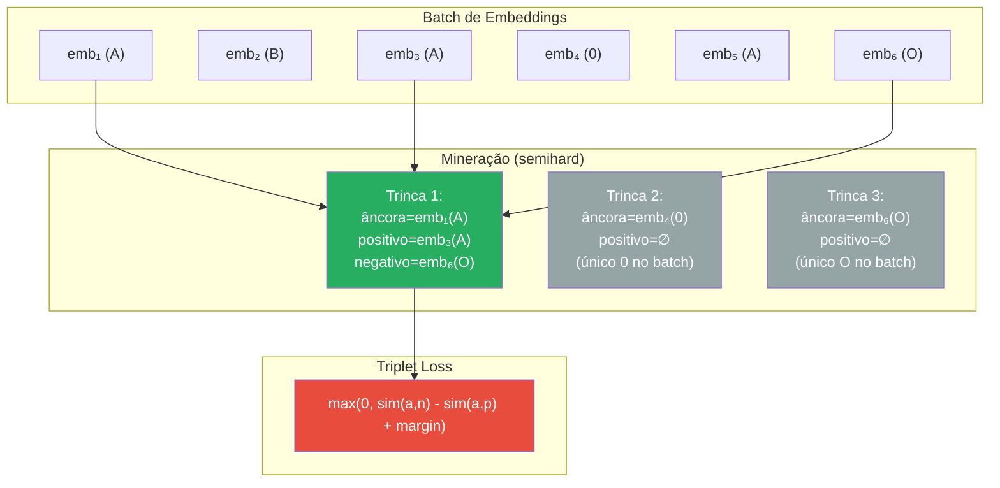

### 4.5 Warm-up do λ Contrastivo

O peso λ da perda contrastiva sobe **linearmente** de 0 até o valor configurado durante as primeiras `contrastive_warmup` iterações:

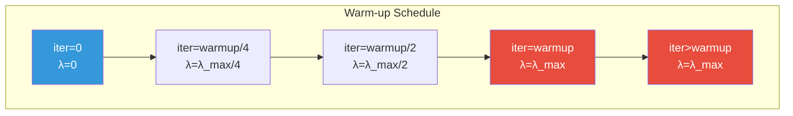

> [!TIP]
> O warm-up permite que o decoder de atenção **estabilize** com a CrossEntropy antes de receber gradientes da perda contrastiva, evitando desestabilização do treinamento.

---

## 5. Fluxo de Dados — Forward Pass Completo (com Contrastiva)

Sequência detalhada de operações no [`model.py`](file:///home/andre/dev/research/constrastive-deep-text-recognition-benchmark/model.py) e [`train.py`](file:///home/andre/dev/research/constrastive-deep-text-recognition-benchmark/train.py):

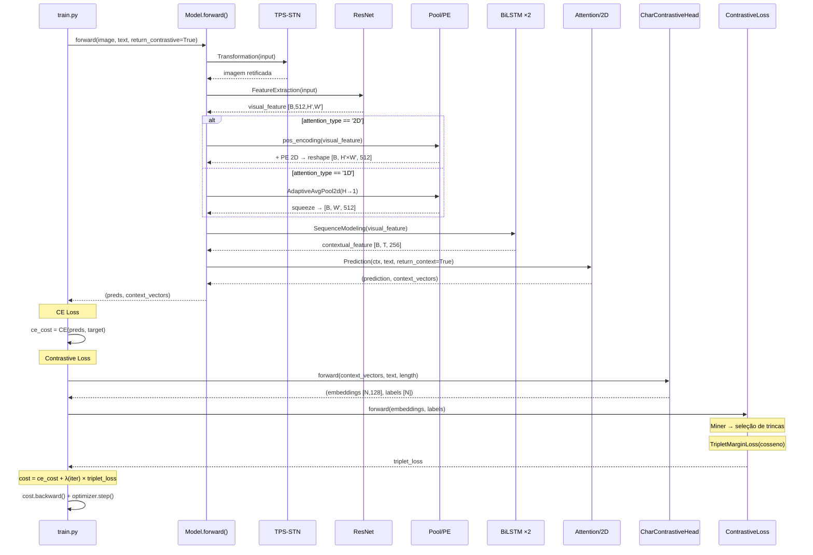

---

## 6. Mapa de Arquivos e Dependências

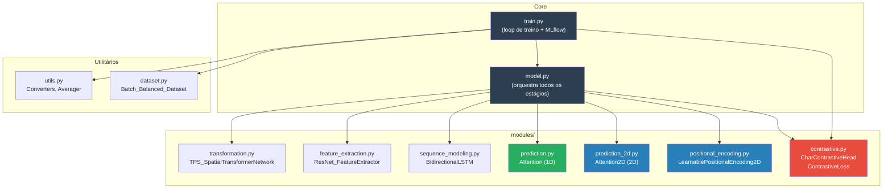

---

## 7. Comparação das Três Configurações

```mermaid
graph TB
    subgraph "🟢 Baseline TRBA (1D)"
        direction LR
        B_IMG["Img"] --> B_TPS["TPS"] --> B_RES["ResNet"] --> B_POOL["AvgPool<br/>H→1"] --> B_LSTM["BiLSTM"] --> B_ATT["Attn 1D<br/>26 pos"] --> B_CE["CE Loss"]
    end

    subgraph "🔵 TRBA + Atenção 2D"
        direction LR
        D_IMG["Img"] --> D_TPS["TPS"] --> D_RES["ResNet"] --> D_PE["PE 2D<br/>flatten"] --> D_LSTM["BiLSTM/<br/>Transf."] --> D_ATT["Attn 2D<br/>78 pos"] --> D_CE["CE Loss"]
    end

    subgraph "🔴 TRBA + Atenção 2D + Contrastiva"
        direction LR
        C_IMG["Img"] --> C_TPS["TPS"] --> C_RES["ResNet"] --> C_PE2["PE 2D<br/>flatten"] --> C_LSTM["BiLSTM/<br/>Transf."] --> C_ATT["Attn 2D<br/>78 pos"]
        C_ATT --> C_CE["CE Loss"]
        C_ATT -->|"ctx vectors"| C_CTR["Contrastive<br/>Branch"] --> C_TRIP["λ·Triplet"]
        C_CE --> C_TOTAL["Total"]
        C_TRIP --> C_TOTAL
    end

    style B_POOL fill:#27ae60,color:#fff
    style B_ATT fill:#27ae60,color:#fff
    style D_PE fill:#2980b9,color:#fff
    style D_ATT fill:#2980b9,color:#fff
    style C_PE2 fill:#2980b9,color:#fff
    style C_ATT fill:#2980b9,color:#fff
    style C_CTR fill:#e74c3c,color:#fff
    style C_TRIP fill:#e74c3c,color:#fff
    style C_TOTAL fill:#f39c12,color:#fff
```

### Resumo de Parâmetros

| Componente | Parâmetros | Módulo novo? |
|---|---|---|
| TPS-STN | ~200K | ❌ (baseline) |
| ResNet (512 ch) | ~44M | ❌ (baseline) |
| BiLSTM ×2 | ~4M | ❌ (baseline) |
| Attention 1D | ~330K | ❌ (baseline) |
| Attention2D | ~330K | 🔵 (mesmo tamanho, diferença semântica) |
| PE 2D aprendido | ~37K | 🔵 |
| CharContrastiveHead | ~100K | 🔴 |
| **Total (baseline)** | **~49M** | |
| **Total (2D + contrastiva)** | **~49.1M** | (+0.3% de parâmetros) |

> [!NOTE]
> As modificações (Atenção 2D + Branch Contrastiva) adicionam apenas **~137K parâmetros** (~0.3%) ao modelo, sendo computacionalmente leves. O overhead principal vem da mineração de trincas (~5-10% por iteração) e do campo de atenção expandido (78 vs 26 posições).

---

## 8. Comandos de Treinamento

```bash
# 🟢 Baseline TRBA (1D) — sem modificações
python train.py \
  --Transformation TPS --FeatureExtraction ResNet \
  --SequenceModeling BiLSTM --Prediction Attn \
  --imgH 32 --imgW 100 \
  --batch_size 192 --num_iter 300000

# 🔵 TRBA + Atenção 2D
python train.py \
  --Transformation TPS --FeatureExtraction ResNet \
  --SequenceModeling BiLSTM --Prediction Attn \
  --attention_type 2D \
  --imgH 64 --imgW 100 \
  --batch_size 192 --num_iter 300000

# 🔴 TRBA + Atenção 2D + Branch Contrastiva
python train.py \
  --Transformation TPS --FeatureExtraction ResNet \
  --SequenceModeling BiLSTM --Prediction Attn \
  --attention_type 2D \
  --imgH 64 --imgW 100 \
  --use_contrastive \
  --contrastive_margin 0.5 \
  --contrastive_lambda 0.1 \
  --contrastive_mining semihard \
  --contrastive_warmup 5000 \
  --batch_size 192 --num_iter 300000
```
