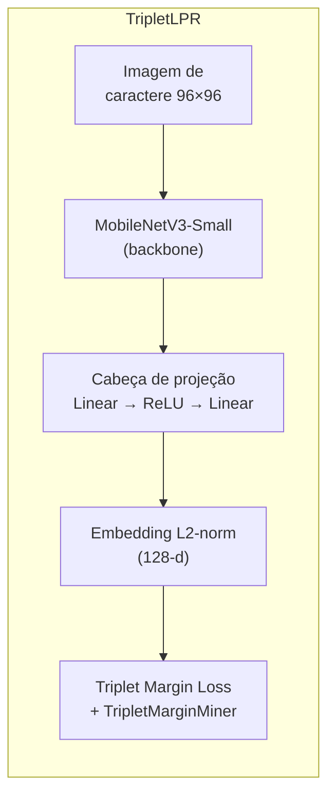
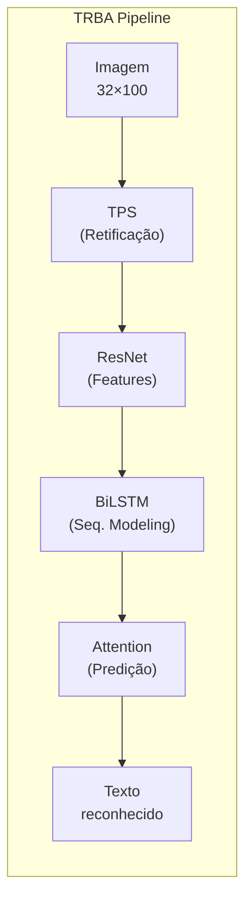
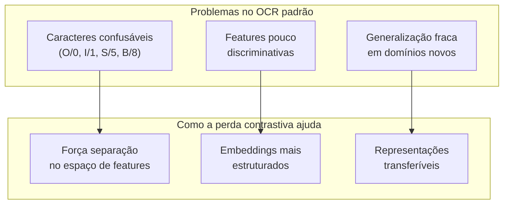
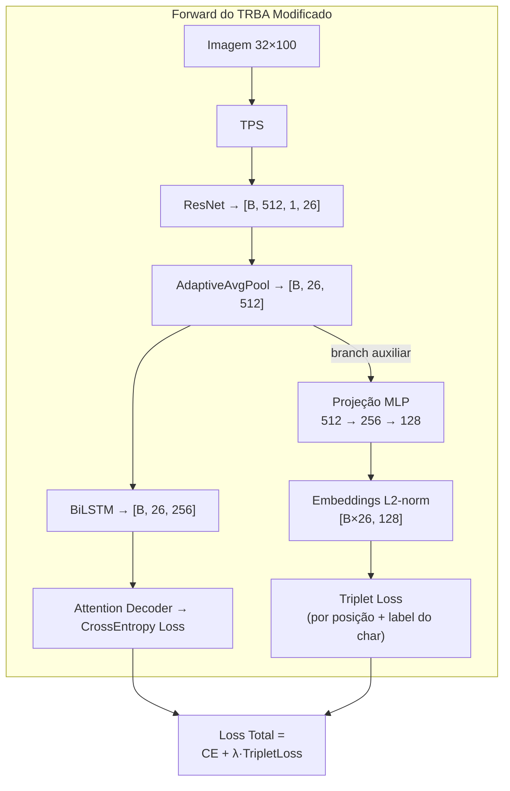
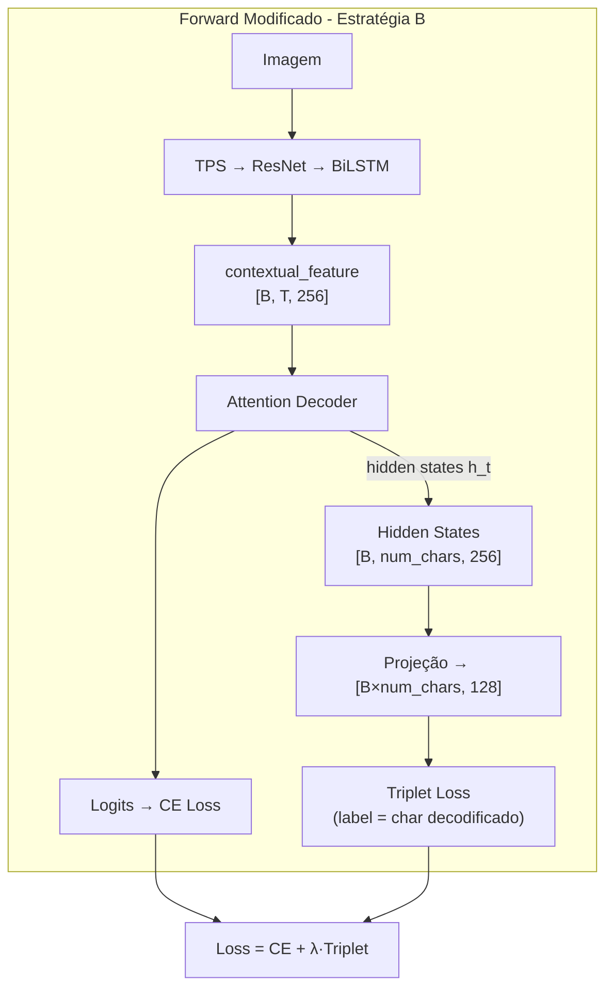
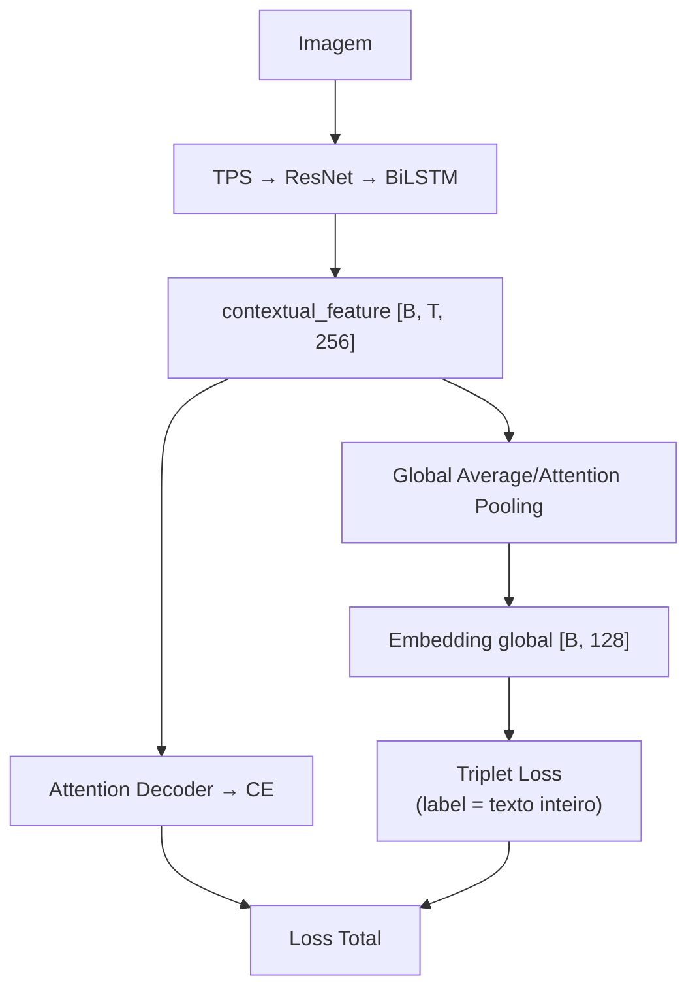
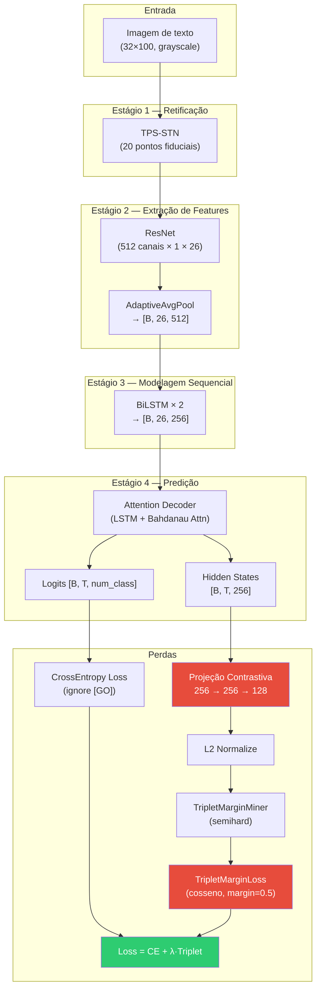

# Integração de Perda Contrastiva (Triplet Loss) ao TRBA

## 1. Visão Geral dos Dois Projetos

### 1.1 TripletLPR — Aprendizado Métrico para Reconhecimento de Placas

O projeto [TripletLPR](file:///home/edge/dev/research/msc_andre_santos/src/TripletLPR) implementa um sistema de reconhecimento de caracteres de placas veiculares baseado em **aprendizado métrico contrastivo**. A ideia central é treinar um encoder que projete imagens de caracteres individuais em um espaço de embeddings onde:

- Caracteres da **mesma classe** (ex.: todos os "A") fiquem **próximos** (alta similaridade cosseno)
- Caracteres de **classes diferentes** (ex.: "A" vs "B") fiquem **afastados** (baixa similaridade)



**Componentes-chave em** [lpr_models.py](file:///home/edge/dev/research/msc_andre_santos/src/TripletLPR/lpr_models.py):

| Componente | Classe | Descrição |
|---|---|---|
| Base contrastivo | [ALPREmbeddingNet](file:///home/edge/dev/research/msc_andre_santos/src/TripletLPR/lpr_models.py#L271-L293) | MobileNetV3 → embedding 128-d, sem atenção |
| Com atenção | [ALPREmbeddingNetWithAttention](file:///home/edge/dev/research/msc_andre_santos/src/TripletLPR/lpr_models.py#L297-L349) | Idem + Spatial Attention no feature map intermediário |
| Classificador | [ALPRClassifierNet](file:///home/edge/dev/research/msc_andre_santos/src/TripletLPR/lpr_models.py#L355-L433) | CrossEntropy (baseline comparativo) |
| Mixin de perda | [_ContrastiveMixin](file:///home/edge/dev/research/msc_andre_santos/src/TripletLPR/lpr_models.py#L200-L266) | `TripletMarginLoss` + `TripletMarginMiner` (pytorch-metric-learning) |

**Mecânica da perda contrastiva** (definida no [_ContrastiveMixin._setup_loss](file:///home/edge/dev/research/msc_andre_santos/src/TripletLPR/lpr_models.py#L203-L206)):

```python
dist = distances.CosineSimilarity()
self._miner = miners.TripletMarginMiner(margin=margin, type_of_triplets=mining_type, distance=dist)
self._loss_func = losses.TripletMarginLoss(margin=margin, distance=dist)
```

1. **Mineração de trincas**: Para cada batch, o `TripletMarginMiner` seleciona trincas (âncora, positivo, negativo) usando estratégia *semihard*, *hard* ou *all*
2. **Cálculo da perda**: `TripletMarginLoss` penaliza quando `dist(âncora, negativo) - dist(âncora, positivo) < margem`
3. **Amostragem especial**: O [MPerClassSampler](file:///home/edge/dev/research/msc_andre_santos/src/TripletLPR/data.py#L57-L62) garante M exemplares por classe em cada batch, essencial para mineração eficaz

---

### 1.2 TRBA — TPS-ResNet-BiLSTM-Attn para OCR

O projeto [deep-text-recognition-benchmark](file:///home/edge/dev/research/deep-text-recognition-benchmark) implementa o framework modular TRBA para reconhecimento de texto em cena (STR). A arquitetura é um pipeline de 4 estágios:



**Módulos em** [model.py](file:///home/edge/dev/research/deep-text-recognition-benchmark/model.py):

| Estágio | Módulo | Arquivo | Papel |
|---|---|---|---|
| Transformation | [TPS_SpatialTransformerNetwork](file:///home/edge/dev/research/deep-text-recognition-benchmark/modules/transformation.py#L8-L39) | transformation.py | Retifica distorções geométricas via Thin-Plate Spline |
| Feature Extraction | [ResNet_FeatureExtractor](file:///home/edge/dev/research/deep-text-recognition-benchmark/modules/feature_extraction.py#L54-L62) | feature_extraction.py | Extrai features visuais (512 canais) |
| Sequence Modeling | [BidirectionalLSTM](file:///home/edge/dev/research/deep-text-recognition-benchmark/modules/sequence_modeling.py#L4-L19) | sequence_modeling.py | Modela dependências contextuais na sequência |
| Prediction | [Attention](file:///home/edge/dev/research/deep-text-recognition-benchmark/modules/prediction.py#L7-L58) | prediction.py | Decodifica caracteres com atenção seq2seq |

**Perda atual** (em [train.py](file:///home/edge/dev/research/deep-text-recognition-benchmark/train.py#L98-L99)):
```python
criterion = torch.nn.CrossEntropyLoss(ignore_index=0).to(device)  # para Attn
```
O modelo é treinado exclusivamente com CrossEntropy por caractere decodificado — **não há nenhum componente de aprendizado métrico**.

---

## 2. Motivação: Por que Adicionar Perda Contrastiva ao TRBA?

> [!IMPORTANT]
> O TRBA reconhece **sequências inteiras** de texto (palavras/placas), enquanto o TripletLPR reconhece **caracteres individuais**. A integração não é trivial e requer decisões arquiteturais cuidadosas.

### 2.1 Problemas que a Perda Contrastiva pode Resolver



1. **Discriminação de caracteres confusáveis**: O Triplet Loss força o encoder a maximizar a distância entre caracteres visualmente semelhantes ("O" vs "0", "I" vs "1"), problema crítico em placas veiculares
2. **Regularização das features internas**: Mesmo sem mudar a saída final (predição de sequência), a perda contrastiva funciona como uma *regularização auxiliar* que estrutura o espaço de features
3. **Melhor transferência de domínio**: Embeddings contrastivos tendem a ser mais robustos quando o modelo é aplicado a domínios diferentes (ex.: treinar com MJSynth, testar em placas brasileiras)

---

## 3. Estratégias de Integração

### Estratégia A — Perda Contrastiva nas Features Visuais (por posição temporal)

Esta é a abordagem mais direta. Extraímos embeddings das features visuais do ResNet (antes do BiLSTM) e aplicamos Triplet Loss **por posição temporal** — cada coluna do feature map corresponde a uma posição potencial de caractere.



**Vantagens:**
- Não modifica o decoder de atenção
- A perda contrastiva age diretamente nas features visuais, melhorando a discriminação antes do LSTM

**Desvantagens:**
- Precisa de um **alinhamento caractere-posição** para saber qual label atribuir a cada coluna (pode ser aproximado com o mapa de atenção ou com CTC alignment)
- Não garante que cada coluna corresponda a exatamente um caractere

**Implementação sugerida:**

```python
class ContrastiveProjectionHead(nn.Module):
    """Cabeça de projeção para embeddings contrastivos."""
    def __init__(self, input_dim=512, hidden_dim=256, embedding_dim=128):
        super().__init__()
        self.projector = nn.Sequential(
            nn.Linear(input_dim, hidden_dim),
            nn.ReLU(),
            nn.Dropout(0.2),
            nn.Linear(hidden_dim, embedding_dim),
        )

    def forward(self, x):
        # x: [B, T, C] → [B*T, C] → projeção → L2-norm
        B, T, C = x.shape
        x_flat = x.reshape(B * T, C)
        emb = self.projector(x_flat)
        return F.normalize(emb, p=2, dim=1).reshape(B, T, -1)
```

---

### Estratégia B — Perda Contrastiva nos Hidden States do Attention Decoder (Recomendada) ⭐

Nesta abordagem, usamos os **hidden states do decoder de atenção** no momento em que cada caractere é decodificado. Isso é mais natural porque:
- Cada hidden state `h_t` já está alinhado com um caractere específico
- O label de cada posição é conhecido (é o ground truth da sequência)



**Vantagens:**
- Alinhamento perfeito: sabemos exatamente qual caractere cada hidden state representa
- Regulariza o decoder diretamente — onde as confusões acontecem
- Compatível com teacher forcing (treino padrão do Attention decoder)

**Desvantagens:**
- Requer modificar o [Attention.forward](file:///home/edge/dev/research/deep-text-recognition-benchmark/modules/prediction.py#L23-L58) para retornar os hidden states
- O batch de embeddings contrastivos tem tamanho variável (diferentes comprimentos de label)

---

### Estratégia C — Perda Contrastiva Global na Representação da Sequência

Cria um embedding global da palavra inteira, usando o último hidden state do BiLSTM ou uma média ponderada por atenção. A Triplet Loss então opera sobre **palavras** — palavras iguais devem estar próximas, palavras diferentes distantes.



**Vantagens:**
- Mais simples — não precisa de alinhamento por caractere
- Útil para tarefas downstream como busca por similaridade de placas

**Desvantagens:**
- Menos eficaz para resolver confusões de caracteres individuais
- Necessita muitos exemplos repetidos da mesma palavra (pouco prático para vocabulários grandes)

---

## 4. Proposta Detalhada de Implementação (Estratégia B)

### 4.1 Modificações Necessárias

#### 4.1.1 Modificar `modules/prediction.py` — Retornar Hidden States

O [Attention.forward](file:///home/edge/dev/research/deep-text-recognition-benchmark/modules/prediction.py#L23-L58) atualmente retorna apenas `probs`. Precisamos que retorne também os hidden states para calcular a perda contrastiva:

```diff
- def forward(self, batch_H, text, is_train=True, batch_max_length=25):
+ def forward(self, batch_H, text, is_train=True, batch_max_length=25, return_hidden=False):
      batch_size = batch_H.size(0)
      num_steps = batch_max_length + 1

      output_hiddens = torch.FloatTensor(batch_size, num_steps, self.hidden_size).fill_(0).to(device)
      hidden = (torch.FloatTensor(batch_size, self.hidden_size).fill_(0).to(device),
                torch.FloatTensor(batch_size, self.hidden_size).fill_(0).to(device))

      if is_train:
          for i in range(num_steps):
              char_onehots = self._char_to_onehot(text[:, i], onehot_dim=self.num_classes)
              hidden, alpha = self.attention_cell(hidden, batch_H, char_onehots)
              output_hiddens[:, i, :] = hidden[0]
          probs = self.generator(output_hiddens)
+
+         if return_hidden:
+             return probs, output_hiddens
          # ... (bloco else similar)

-     return probs
+     if return_hidden:
+         return probs, output_hiddens
+     return probs
```

---

#### 4.1.2 Criar `modules/contrastive.py` — Componentes de Perda Contrastiva

Novo arquivo com o cabeçote de projeção e a lógica de perda:

```python
"""
Módulo de perda contrastiva auxiliar para o TRBA.
Aplica Triplet Margin Loss nos hidden states do decoder de atenção,
forçando discriminação entre caracteres visualmente confusáveis.
"""
import torch
import torch.nn as nn
import torch.nn.functional as F
from pytorch_metric_learning import distances, losses, miners


class CharContrastiveHead(nn.Module):
    """Projeta hidden states do decoder em embeddings contrastivos."""

    def __init__(self, hidden_size=256, embedding_dim=128):
        super().__init__()
        self.projector = nn.Sequential(
            nn.Linear(hidden_size, hidden_size),
            nn.ReLU(),
            nn.Dropout(0.2),
            nn.Linear(hidden_size, embedding_dim),
        )

    def forward(self, hidden_states, text_targets, lengths):
        """
        Args:
            hidden_states: [B, max_steps, hidden_size] do decoder
            text_targets:  [B, max_length+1] índices dos caracteres (com [GO] e [s])
            lengths:       [B] comprimento de cada texto (inclui [s])

        Returns:
            embeddings: [N, embedding_dim] embeddings L2-normalizados
            labels:     [N] índice do caractere correspondente
        """
        all_embs = []
        all_labels = []

        for b in range(hidden_states.size(0)):
            # text_targets[b] = [GO, c1, c2, ..., cn, s, PAD, ...]
            # hidden_states[b, i] corresponde à predição do i-ésimo passo
            # No treino com teacher forcing, hidden[b,i] prediz text[b,i+1]
            seq_len = lengths[b].item()  # inclui [s]
            for t in range(seq_len):
                char_idx = text_targets[b, t + 1].item()  # +1 para pular [GO]
                if char_idx == 0:  # [GO] ou padding
                    continue
                if char_idx == 1:  # [s] (fim de sentença)
                    break
                h = hidden_states[b, t]  # hidden state que prevê este caractere
                all_embs.append(h)
                all_labels.append(char_idx)

        if len(all_embs) == 0:
            return None, None

        embs = torch.stack(all_embs, dim=0)          # [N, hidden_size]
        embs = self.projector(embs)                    # [N, embedding_dim]
        embs = F.normalize(embs, p=2, dim=1)          # L2-norm
        labels = torch.tensor(all_labels, device=embs.device)

        return embs, labels


class ContrastiveLoss(nn.Module):
    """Wrapper para Triplet Margin Loss com mineração."""

    def __init__(self, margin=0.5, mining_type="semihard"):
        super().__init__()
        dist = distances.CosineSimilarity()
        self.miner = miners.TripletMarginMiner(
            margin=margin, type_of_triplets=mining_type, distance=dist
        )
        self.loss_fn = losses.TripletMarginLoss(margin=margin, distance=dist)

    def forward(self, embeddings, labels):
        if embeddings is None:
            return torch.tensor(0.0, requires_grad=True)
        triplets = self.miner(embeddings, labels)
        loss = self.loss_fn(embeddings, labels, triplets)
        return loss
```

---

#### 4.1.3 Modificar `model.py` — Integrar Cabeçote Contrastivo

```diff
  from modules.prediction import Attention
+ from modules.contrastive import CharContrastiveHead

  class Model(nn.Module):

      def __init__(self, opt):
          super(Model, self).__init__()
          # ... (código existente inalterado) ...

+         # Cabeçote contrastivo auxiliar (opcional)
+         self.use_contrastive = getattr(opt, 'use_contrastive', False)
+         if self.use_contrastive:
+             self.contrastive_head = CharContrastiveHead(
+                 hidden_size=opt.hidden_size,
+                 embedding_dim=getattr(opt, 'contrastive_embedding_dim', 128),
+             )

-     def forward(self, input, text, is_train=True):
+     def forward(self, input, text, is_train=True, return_contrastive=False):
          # ... (estágios TPS, ResNet, BiLSTM inalterados) ...

          """ Prediction stage """
          if self.stages['Pred'] == 'CTC':
              prediction = self.Prediction(contextual_feature.contiguous())
          else:
-             prediction = self.Prediction(contextual_feature.contiguous(), text, is_train,
-                                          batch_max_length=self.opt.batch_max_length)
+             if return_contrastive and self.use_contrastive:
+                 prediction, hidden_states = self.Prediction(
+                     contextual_feature.contiguous(), text, is_train,
+                     batch_max_length=self.opt.batch_max_length,
+                     return_hidden=True,
+                 )
+                 return prediction, hidden_states
+             else:
+                 prediction = self.Prediction(
+                     contextual_feature.contiguous(), text, is_train,
+                     batch_max_length=self.opt.batch_max_length,
+                 )

          return prediction
```

---

#### 4.1.4 Modificar `train.py` — Loop de Treino com Perda Combinada

As mudanças no [train.py](file:///home/edge/dev/research/deep-text-recognition-benchmark/train.py) incluem:

```diff
  from model import Model
+ from modules.contrastive import ContrastiveLoss
  
  def train(opt):
      # ... (setup de dados e modelo existente) ...

      """ setup loss """
      if 'CTC' in opt.Prediction:
          criterion = ...
      else:
          criterion = torch.nn.CrossEntropyLoss(ignore_index=0).to(device)
+
+     # Perda contrastiva auxiliar
+     contrastive_criterion = None
+     if getattr(opt, 'use_contrastive', False):
+         contrastive_criterion = ContrastiveLoss(
+             margin=opt.contrastive_margin,
+             mining_type=opt.contrastive_mining,
+         ).to(device)
+         print(f'[*] Contrastive loss habilitada: margin={opt.contrastive_margin}, '
+               f'mining={opt.contrastive_mining}, lambda={opt.contrastive_lambda}')

      # ... dentro do loop de treino ...
      
-         preds = model(image, text[:, :-1])
-         target = text[:, 1:]
-         cost = criterion(preds.view(-1, preds.shape[-1]), target.contiguous().view(-1))
+         if opt.use_contrastive and contrastive_criterion is not None:
+             preds, hidden_states = model(image, text[:, :-1], return_contrastive=True)
+         else:
+             preds = model(image, text[:, :-1])
+
+         target = text[:, 1:]
+         ce_cost = criterion(preds.view(-1, preds.shape[-1]), target.contiguous().view(-1))
+
+         # Perda contrastiva
+         contrastive_cost = torch.tensor(0.0).to(device)
+         if opt.use_contrastive and contrastive_criterion is not None:
+             char_embs, char_labels = model.module.contrastive_head(
+                 hidden_states, text, length
+             )
+             contrastive_cost = contrastive_criterion(char_embs, char_labels)
+
+         cost = ce_cost + opt.contrastive_lambda * contrastive_cost
```

**Novos argumentos CLI:**

```python
# Em train.py, seção de argparse:
parser.add_argument('--use_contrastive', action='store_true',
                    help='Habilitar perda contrastiva auxiliar')
parser.add_argument('--contrastive_margin', type=float, default=0.5,
                    help='Margem para o Triplet Loss')
parser.add_argument('--contrastive_lambda', type=float, default=0.1,
                    help='Peso da perda contrastiva na perda total')
parser.add_argument('--contrastive_mining', type=str, default='semihard',
                    choices=['semihard', 'hard', 'all'],
                    help='Estratégia de mineração de trincas')
parser.add_argument('--contrastive_embedding_dim', type=int, default=128,
                    help='Dimensão do embedding contrastivo')
```

---

## 5. Considerações Práticas

### 5.1 Amostragem do Batch

> [!WARNING]
> O TripletLPR usa `MPerClassSampler` para garantir M exemplares por classe em cada batch. No TRBA, os "exemplares por classe" são os **caracteres dentro da própria sequência**. Um batch de 192 imagens de texto com ~7 caracteres cada gera ~1344 embeddings de caracteres, onde naturalmente muitos caracteres se repetem (especialmente dígitos e letras comuns). Isso torna a mineração de trincas viável **sem sampler especial**.

### 5.2 Escolha do λ (peso da perda contrastiva)

| λ | Comportamento esperado |
|---|---|
| 0.01–0.05 | Regularização suave; pouco impacto na acurácia |
| 0.1–0.3 | **Faixa recomendada** para início; boa discriminação sem desestabilizar |
| 0.5–1.0 | Agressivo; pode degradar a convergência da CE se usado desde o início |

> [!TIP]
> **Warm-up contrastivo**: Comece com λ=0 por algumas iterações (ex.: 10k) e aumente gradualmente até o valor alvo. Isso permite que o decoder estabilize antes de receber gradientes contrastivos.

### 5.3 Custos Computacionais

| Componente | Parâmetros adicionais | Overhead estimado |
|---|---|---|
| `CharContrastiveHead` | ~100K (256→256→128) | Desprezível vs. TRBA (~49M) |
| Mineração de trincas | 0 (operação no batch) | ~5–10% por iteração |
| Memória GPU | Embeddings [N, 128] | ~2–4 MB por batch |

---

## 6. Exemplo de Comando de Treino

```bash
# Treino padrão TRBA (sem contrastivo)
python train.py \
  --train_data data_lmdb/training \
  --valid_data data_lmdb/validation \
  --Transformation TPS --FeatureExtraction ResNet \
  --SequenceModeling BiLSTM --Prediction Attn \
  --sensitive --adam --lr 0.001 \
  --batch_size 192 --num_iter 300000

# Treino TRBA + Perda Contrastiva
python train.py \
  --train_data data_lmdb/training \
  --valid_data data_lmdb/validation \
  --Transformation TPS --FeatureExtraction ResNet \
  --SequenceModeling BiLSTM --Prediction Attn \
  --sensitive --adam --lr 0.001 \
  --batch_size 192 --num_iter 300000 \
  --use_contrastive \
  --contrastive_margin 0.5 \
  --contrastive_lambda 0.1 \
  --contrastive_mining semihard
```

---

## 7. Métricas de Avaliação Adicionais

Além da acurácia de sequência e edit distance normalizadas já usadas em [test.py](file:///home/edge/dev/research/deep-text-recognition-benchmark/test.py), a integração permite novas métricas:

1. **Confusão por caractere**: Matriz de confusão entre caracteres mais errados (útil para avaliar se o contrastivo resolve O/0, I/1 etc.)
2. **Silhouette Score** dos embeddings do `CharContrastiveHead` — mede a qualidade dos clusters no espaço de embeddings
3. **t-SNE dos embeddings por caractere** — reutilizando a função [plot_embeddings](file:///home/edge/dev/research/msc_andre_santos/src/TripletLPR/utils.py#L39-L116) do TripletLPR, adaptada para extrair os hidden states do decoder

---

## 8. Variantes Avançadas

### 8.1 Perda Contrastiva com Pares Confusáveis (Directed Mining)

O TripletLPR já implementa um [ConfusableTripletMiner](file:///home/edge/dev/research/msc_andre_santos/src/TripletLPR/data.py#L100-L143) que seleciona negativos especificamente de classes confusáveis. Isso pode ser portado para o TRBA:

```python
CONFUSABLES_LPR = {
    'O': ['0', 'Q', 'D'],
    '0': ['O', 'Q', 'D'],
    'I': ['1', 'L'],
    '1': ['I', 'L'],
    'S': ['5'],
    '5': ['S'],
    'B': ['8'],
    '8': ['B'],
}
```

### 8.2 Center Loss + Triplet Loss

Combinar a Triplet Loss com Center Loss (que mantém um centroide por classe atualizado online) pode estabilizar o treino:

```
Loss_total = CE + λ₁·TripletLoss + λ₂·CenterLoss
```

### 8.3 SupCon (Supervised Contrastive Loss)

Alternativa moderna ao Triplet Loss que usa todos os positivos e negativos no batch simultaneamente (InfoNCE supervisionado). Evita a instabilidade da mineração de trincas.

---

## 9. Resumo das Modificações por Arquivo

| Arquivo | Ação | Descrição |
|---|---|---|
| [modules/contrastive.py](file:///home/edge/dev/research/deep-text-recognition-benchmark/modules/contrastive.py) | **CRIAR** | `CharContrastiveHead` + `ContrastiveLoss` |
| [modules/prediction.py](file:///home/edge/dev/research/deep-text-recognition-benchmark/modules/prediction.py) | MODIFICAR | `Attention.forward` retorna `hidden_states` opcionalmente |
| [model.py](file:///home/edge/dev/research/deep-text-recognition-benchmark/model.py) | MODIFICAR | Instancia `CharContrastiveHead`; propaga `return_contrastive` |
| [train.py](file:///home/edge/dev/research/deep-text-recognition-benchmark/train.py) | MODIFICAR | Perda combinada CE + λ·Triplet; novos args CLI |
| [test.py](file:///home/edge/dev/research/deep-text-recognition-benchmark/test.py) | MODIFICAR (opcional) | Extração de embeddings para análise t-SNE |

> [!NOTE]
> A dependência `pytorch-metric-learning` precisa ser instalada:
> ```bash
> pip install pytorch-metric-learning
> ```

---

## 10. Diagrama Completo da Arquitetura Proposta


