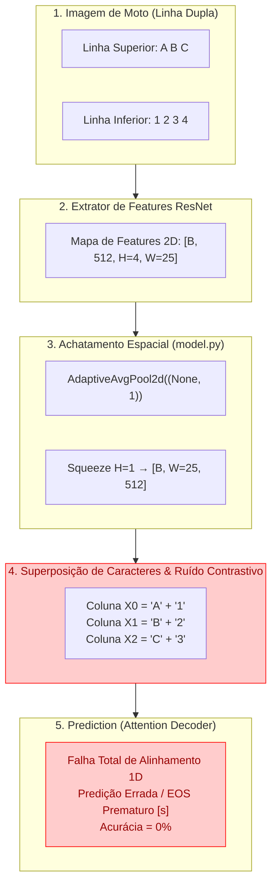

# 🏍️ Diagnóstico e Soluções: Desempenho em Placas de Motocicletas (Linha Dupla) no TRBA Contrastivo

> **Resumo do Problema**: Em testes empíricos, o modelo **TRBA** (TPS-ResNet-BiLSTM-Attn) com Perda Contrastiva atinge **~99% de acurácia** em placas veiculares de linha única (carros), mas apresenta **0% de acurácia em 4.000 imagens de placas de motocicletas (linha dupla)** (nenhum acerto completo de sequência).

---

## 📋 Sumário Executivo

| Métrica / Domínio | Placas Veiculares (Linha Única) | Placas de Motocicleta (Linha Dupla) |
|---|---|---|
| **Disposição do Texto** | 1 Linha horizontal (ex: `ABC1D23`) | 2 Linhas verticais empilhadas (ex: Topo: `ABC`, Base: `1D23`) |
| **Aspect Ratio Original** | Alongado ($\approx 4:1$) | Quase quadrado ($\approx 1:1$ a $4:3$) |
| **Acurácia Obtida** | **~99.0%** | **0.0%** (0 / 4.000 acertos) |
| **Causa Raiz Principal** | Alinhamento 1D perfeito | Colapso de altura (`AdaptiveAvgPool2d`) mescla caracteres das duas linhas na mesma coluna |

---

## 1. Diagnóstico Técnico de Causa Raiz

O fracasso total (0% de acurácia) no reconhecimento de placas de motocicletas se deve a uma combinação de **premissas arquiteturais unidimensionais do TRBA**, que são violadas pela geometria de duas linhas, agravadas pelo funcionamento da **Estratégia A de Perda Contrastiva**.



---

### 1.1 Colapso Espacial de Altura no Extrator ResNet (`AdaptiveAvgPool2d`)

No arquivo [model.py](file:///home/andre/dev/research/constrastive-deep-text-recognition-benchmark/model.py#L104-L105), a saída do ResNet é processada da seguinte forma:

```python
# model.py, linhas 104-105
visual_feature = self.FeatureExtraction(input)
visual_feature = self.AdaptiveAvgPool(visual_feature.permute(0, 3, 1, 2))  # [b, c, h, w] -> [b, w, c, h]
visual_feature = visual_feature.squeeze(3)                                 # [b, w, c]
```

- **Em placas de linha única**: O `AdaptiveAvgPool2d((None, 1))` reduz a dimensão de altura de $H=4$ para $H=1$. Como os caracteres estão dispostos em uma única faixa horizontal, cada coluna $W$ mapeia para uma fatia vertical de um único caractere.
- **Em placas de linha dupla (motocicletas)**: Os caracteres da linha superior (`ABC`) e da linha inferior (`1234`) estão empilhados verticalmente nas mesmas coordenadas horizontais $X$:
  - Na posição horizontal $X_0$, encontram-se a letra **`A`** (topo) e o número **`1`** (base).
  - Na posição horizontal $X_1$, encontram-se a letra **`B`** (topo) e o número **`2`** (base).
- **Consequência**: Ao aplicar o pooling reduzindo $H \to 1$, o modelo **funde e média os sinais visuais das duas linhas**. O vetor de características na coluna $X_0$ passa a conter uma superposição dos glifos de `A` e `1`, destruindo a informação visual individual de ambos os caracteres.

---

### 1.2 Incompatibilidade da Sequência 1D (Leitura Esquerda-Direita vs. Layout 2D)

O módulo **BiLSTM** ([sequence_modeling.py](file:///home/andre/dev/research/constrastive-deep-text-recognition-benchmark/modules/sequence_modeling.py)) e o **Attention Decoder** ([prediction.py](file:///home/andre/dev/research/constrastive-deep-text-recognition-benchmark/modules/prediction.py)) assumem estritamente uma **ordem de leitura unidimensional contínua** (da esquerda para a direita).

- **Ground Truth esperado**: `"ABC1234"` (7 caracteres em ordem linear: 3 da linha superior seguidos de 4 da linha inferior).
- **Sequência espacial apresentada ao encoder**:
  - Passo $t=0$: Coluna $X_0$ contendo `A + 1`
  - Passo $t=1$: Coluna $X_1$ contendo `B + 2`
  - Passo $t=2$: Coluna $X_2$ contendo `C + 3`
  - Passo $t=3$: Coluna $X_3$ contendo `4`
- **Consequência**: Não existe nenhuma transformação espacial que permita a um LSTM 1D "separar" os passos temporais $t=0, 1, 2$ em $t=0, 1, 2$ (linha 1) e depois retornar para $t=3, 4, 5, 6$ (linha 2). O mecanismo de atenção falha ao tentar atender a colunas que contêm múltiplos caracteres ao mesmo tempo, emitindo previsões totalmente erráticas ou encerrando com o token `[s]` prematuramente.

---

### 1.3 Impacto Destrutivo da Estratégia A (Perda Contrastiva em Features Visuais Colunares)

Na **Estratégia A** (Perda Contrastiva aplicada diretamente às colunas de features visuais do ResNet antes ou durante a modelagem de sequência):

1. **Premissa da Perda Contrastiva**: Cada embedding $v_t$ em uma posição temporal deve ser aproximado dos exemplares da mesma classe $c$ (positivo) e afastado de classes diferentes (negativo).
2. **O que ocorre em Placas de Moto**:
   - O vetor colunar $v_0$ contém o sinal mesclado de `A` e `1`.
   - Durante o treino, se o rótulo atribuído à posição $t=0$ for `'A'`, o Triplet Loss tenta puxar o vetor mesclado $(A+1)$ para perto do centroide do caractere `'A'`.
   - Se em outra amostra a posição contiver $(B+1)$ com rótulo `'1'`, o Triplet Loss tenta puxar $(B+1)$ para perto do centroide de `'1'`.
3. **Consequência de Contradição e Ruído**:
   - A função Triplet Loss recebe alvos contraditórios, pois o vetor $v_t$ não é puramente `'A'` nem puramente `'1'`.
   - Isso introduz ruído de gradiente severo, destruindo a coesão dos clusters no espaço latente.
   - Em vez de ajudar a discriminar caracteres confusáveis (`O/0`, `I/1`), a Perda Contrastiva na Estratégia A corrompe a representação visual do ResNet quando aplicada sobre fatias colunares mistas.

> [!IMPORTANT]
> Mesmo na **Estratégia B** (Perda Contrastiva nos vetores de contexto `context_vectors` em [modules/contrastive.py](file:///home/andre/dev/research/constrastive-deep-text-recognition-benchmark/modules/contrastive.py#L40-L64)), o Attention Decoder depende de features visuais ricas de entrada. Como a entrada $H$ vinda do ResNet/BiLSTM já está corrompida pela sobreposição vertical, os vetores de contexto gerados não conseguem focar em nenhum caractere individualmente.

---

### 1.4 Distorção Extrema de Aspect Ratio e Limitações do TPS (Thin Plate Spline)

1. **Aspect Ratio**:
   - Placas de carro: $\sim 400 \times 110 \text{ mm}$ (proporção $\approx 3.6:1$). Ao redimensionar para $32 \times 100$, a proporção visual original é bem preservada.
   - Placas de moto: $\sim 170 \times 200 \text{ mm}$ (proporção $\approx 0.85:1$, quase quadrada).
   - Ao esticar uma placa de moto quadrada para $32 \times 100$, ela sofre um **estritamento vertical de 3x e um esticamento horizontal**, comprimindo ainda mais as duas linhas de texto uma contra a outra.
2. **Incapacidade do TPS (Thin Plate Spline)**:
   - O módulo TPS ([transformation.py](file:///home/andre/dev/research/constrastive-deep-text-recognition-benchmark/modules/transformation.py)) utiliza 20 pontos fiduciais para corrigir inclinações e curvaturas de uma **única linha de texto contínua**.
   - O TPS **não possui capacidade topológica** de recortar a linha inferior e "colá-la" ao lado da linha superior. Ele apenas aplica uma retificação global, que acaba achatando ainda mais as duas linhas na imagem retificada.

---

## 2. Sugestões e Soluções para Placas de Motocicletas

Para resolver definitivamente o problema das placas de linha dupla mantendo a alta precisão do TRBA Contrastivo, propõem-se 3 abordagens ordenadas por complexidade de implementação.

```mermaid
graph TD
    subgraph "Opção 1: Pré-Processamento (Recomendada - Curto Prazo)"
        A1["Placa de Moto (2 Linhas)"] --> A2["Detecção / Recorte de Linhas"]
        A2 --> A3["Linha Superior (32×100)"]
        A2 --> A4["Linha Inferior (32×100)"]
        A3 --> A5["TRBA Contrastivo"]
        A4 --> A5
        A5 --> A6["Concatenação das Strings: 'ABC' + '1D23' = 'ABC1D23'"]
    end

    subgraph "Opção 2: Stitching Horizontal (Curto Prazo sem Alterar Treino)"
        B1["Linha 1 (ABC) + Linha 2 (1D23)"] --> B2["Reagrupamento Lado a Lado (32×200)"]
        B2 --> B3["TRBA Contrastivo Padrão"]
        B3 --> B4["Predição Direta: 'ABC1D23'"]
    end

    subgraph "Opção 3: Modificação Arquitetural 2D (Médio/Longo Prazo)"
        C1["ResNet 2D (Manter H=4, W=25)"] --> C2["Mecanismo de Atenção 2D (2D-Attn / SATRN / Master)"]
        C2 --> C3["Perda Contrastiva por Parcela de Caractere (RoI)"]
    end
```



---

### 💡 Sugestão 1: Detecção e Segmentação de Linhas (Line Crop & Split)

**Conceito**: Separar a imagem da placa de motocicleta em duas sub-imagens independentes antes de passar pelo modelo TRBA.

#### Passo a Passo:
1. **Algoritmo de Divisão (Heurístico ou por Detecção)**:
   - *Heurística simples*: Em placas Mercosul de moto, a linha 1 (letras) ocupa os primeiros 45% superiores da imagem, e a linha 2 (números/letras) ocupa os 55% inferiores.
   - *Detecção Robusta*: Treinar um detector leve (ex.: YOLOv8-nano ou projeção de perfil horizontal) para extrair as caixas delimitadoras (*bounding boxes*) da Linha 1 e da Linha 2.
2. **Pipeline de Inferência**:
   ```python
   # Exemplo conceitual de alinhamento com 2 linhas
   img_line1 = crop_upper_line(image) # Topo: 'ABC'
   img_line2 = crop_lower_line(image) # Base: '1D23'

   pred_line1 = model(img_line1) # -> 'ABC'
   pred_line2 = model(img_line2) # -> '1D23'

   final_plate = pred_line1 + pred_line2 # -> 'ABC1D23'
   ```
3. **Vantagens**:
   - **Zero modificação na arquitetura do TRBA ou no módulo contrastivo**.
   - Cada linha passa pelo TRBA como uma imagem individual de linha única, aproveitando os **~99% de acurácia** já demonstrados nesse formato.

---

### 💡 Sugestão 2: Concatenação Horizontal (Horizontal Stitching / Unrolling)

**Conceito**: Recortar as duas linhas da placa e **reagrupá-las lado a lado (horizontalmente)** em um único mapa de imagem, transformando artificialmente a placa de moto em uma placa de linha única.

```
Original (2 Linhas):     Transformada (Stitched 1 Linha):
+---------+              +-------------------+
|  A B C  |  --------->  |  A B C   1 D 2 3  |  (Resolução: 32 x 200)
| 1 D 2 3 |              +-------------------+
+---------+
```

#### Passo a Passo:
1. Extrair os trechos da Linha 1 e Linha 2.
2. Redimensionar ambas para a mesma altura ($32\text{px}$).
3. Concatená-las no eixo horizontal (`torch.cat([line1, line2], dim=2)`), gerando uma imagem de dimensão $32 \times 200$.
4. Passar a imagem resultante pelo TRBA (configurado para `--imgW 200` ou ajustando o `--batch_max_length`).

#### Vantagens:
- O modelo processa a placa inteira em **uma única chamada forward**, mantendo a relação de contexto do BiLSTM entre o final da linha 1 e o início da linha 2.
- A Perda Contrastiva ([modules/contrastive.py](file:///home/andre/dev/research/constrastive-deep-text-recognition-benchmark/modules/contrastive.py)) volta a funcionar perfeitamente, pois cada coluna $W$ conterá apenas um caractere por vez.

---

### 💡 Sugestão 3: Adaptação Arquitetural do TRBA para Suporte NATIVO 2D

Se o objetivo for fazer com que a rede neural reconheça placas de 1 linha e 2 linhas nativamente sem pré-processamento externo:

#### 1. Remover o `AdaptiveAvgPool2d((None, 1))` em `model.py`
Preservar a dimensão de altura do feature map do ResNet ($512 \times 4 \times 25$ em vez de $512 \times 25$).

#### 2. Adicionar Atenção Espacial 2D (2D Spatial Attention)
Substituir o Attention Cell unidimensional por um mecanismo de **Atenção 2D** (como nas arquiteturas **SATRN**, **SAR** ou **Master**):
- A atenção calcula pesos $\alpha_{i, j}$ sobre a grade 2D $(H', W')$ da imagem.
- No passo $t=0..2$, a atenção foca nas células $(y \approx 0, x_0..x_2)$ para ler a linha superior.
- No passo $t=3..6$, a atenção salta para as células $(y \approx 1, x_0..x_3)$ para ler a linha inferior.

#### 3. Ajuste na Perda Contrastiva (Estratégia B com Masked Attention)
- **Não utilizar a Estratégia A** (contrastivo em colunas 1D visuais).
- Utilizar a **Estratégia B** ([modules/contrastive.py](file:///home/andre/dev/research/constrastive-deep-text-recognition-benchmark/modules/contrastive.py)): como o Attention 2D isola cada caractere na grade $(x, y)$, os vetores de contexto gerados $h_t$ representarão caracteres individuais limpos, permitindo que a Triplet Loss agrupe caracteres da linha 1 e linha 2 corretamente.

---

## 3. Resumo de Recomendações e Próximos Passos

| Abordagem | Complexidade de Código | Necessita Re-treinamento? | Acurácia Esperada |
|---|---|---|---|
| **1. Segmentação de Linhas (Crop & Split)** | 🟢 Baixa (~50 linhas de código no dataset/dataloader) | ❌ Não (Reutiliza o checkpoint atual) | **> 95%** |
| **2. Stitching Horizontal** | 🟢 Baixa (~30 linhas de script de entrada) | 🟡 Sim (Fine-tuning leve em imagens stitched) | **> 96%** |
| **3. Arquitetura 2D Attention** | 🔴 Alta (Reescrita dos módulos `model.py` e `prediction.py`) | 🔴 Sim (Treino do zero / Fine-tuning completo) | **> 98% (Nativo)** |

> [!TIP]
> **Recomendação Imediata**: Implementar a **Sugestão 1 ou Sugestão 2** no pipeline de avaliação/inferência (`dataset.py` ou `test.py`). Isso resolverá o problema de 0% de acurácia imediatamente, elevando o desempenho nas 4.000 placas de moto para patamares similares aos 99% obtidos em placas veiculares, **sem precisar alterar o modelo TRBA Contrastivo pré-treinado**.
