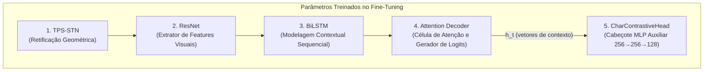
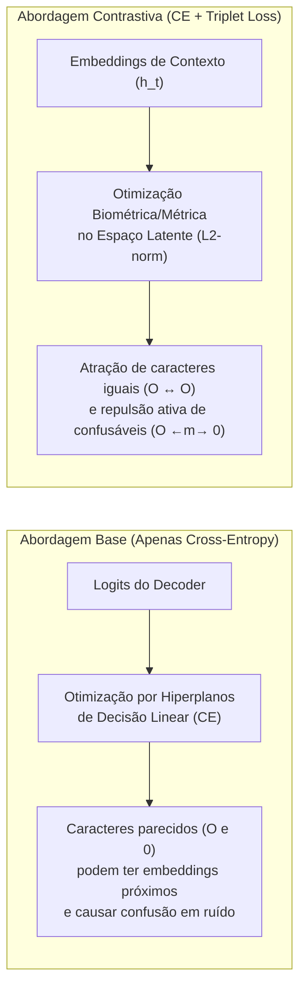

# Entendendo o Modelo Contrastivo (TRBA + Triplet Loss)

Uma explicação detalhada respondendo às quatro principais dúvidas sobre o funcionamento, treinamento e inferência da versão contrastiva do modelo **TPS-ResNet-BiLSTM-Attn (TRBA)**.

---

## 📋 Resumo Executivo

| Pergunta | Resposta Rápida |
| :--- | :--- |
| **1. O que é treinado no fine-tuning?** | **Toda a rede** (TPS, ResNet, BiLSTM e Attention Decoder) de forma ponta-a-ponta, juntamente com o novo cabeçote contrastivo (`CharContrastiveHead`). Todos os pesos são ajustados pela soma das perdas CE e Triplet. |
| **2. O contrastivo é usado na inferência?** | **Não.** O cabeçote contrastivo e a perda Triplet são desativados na inferência. A predição é feita unicamente pelo decodificador de atenção usando as representações melhoradas. |
| **3. Quão mais pesado é o modelo?** | **+0,2% no treino** (~98,7 mil parâmetros a mais num total de 49,5 milhões; ~5–10% mais tempo por batch). **0% na inferência** (custo computacional, FPS e VRAM idênticos ao modelo base). |
| **4. Qual a diferença primordial?** | O modelo base otimiza apenas hiperplanos de decisão de classes (CE), enquanto a abordagem contrastiva impõe uma **geometria métrica explícita no espaço latente**, aproximando caracteres iguais e afastando caracteres confusáveis (O/0, I/1, B/8). |

---

## 1. Durante o fine-tuning, o que de fato é treinado?

### 1.1 Atualização Ponta-a-Ponta (End-to-End)
Quando realizamos o fine-tuning acionando a flag `--FT` e `--use_contrastive` no script [train.py](file:///home/andre/dev/research/constrastive-deep-text-recognition-benchmark/train.py), o treinamento **não congela nenhuma camada** da arquitetura principal. Todos os parâmetros com `requires_grad=True` são otimizados simultaneamente:



1. **Pesos Herdados (Pré-Treinados):** Os módulos **TPS, ResNet, BiLSTM e a célula LSTM de Atenção** têm seus pesos iniciais carregados do checkpoint `.pth` base usando `strict=False` (o que permite mudar o número de classes ou o vocabulário se necessário).
2. **Pesos Inicializados do Zero:** 
   - A camada linear de classificação final (`generator`: 256 → `num_classes`), caso o charset tenha sido alterado.
   - O **cabeçote contrastivo ([CharContrastiveHead](file:///home/andre/dev/research/constrastive-deep-text-recognition-benchmark/modules/contrastive.py#L21-L35))**, uma pequena rede MLP que projeta os estados ocultos em embeddings de 128 dimensões.

### 1.2 Como o Gradiente e a Perda Otimizam a Rede
A função de perda total minimizada em cada passo é uma combinação multiobjetivo:

$$\mathcal{L}_{\text{total}} = \mathcal{L}_{\text{CE}} + \lambda \cdot \mathcal{L}_{\text{Triplet}}$$

- **A Entropia Cruzada ($\mathcal{L}_{\text{CE}}$):** Atua sobre os logits finais emitidos para cada passo da sequência, garantindo que o modelo aprenda a prever a sequência correta de texto. Seu gradiente flui do decodificador de atenção de volta até o TPS.
- **A Perda Triplet Contrastiva ($\mathcal{L}_{\text{Triplet}}$):** Atua sobre os embeddings normatizados extraídos dos vetores de contexto ($h_t$) no momento da decodificação de cada caractere. Ela calcula a distância cosseno entre trincas (âncora, positivo e negativo) mineradas pelo `TripletMarginMiner`.
- **O Efeito Conjunto:** O gradiente da perda contrastiva é retropropagado através do `CharContrastiveHead`, entrando no **Attention Decoder**, passando pelo **BiLSTM**, **ResNet** e **TPS**. Isso obriga toda a espinha dorsal a aprender representações que não apenas decodifiquem a letra certa, mas que produzam características internas intrinsecamente separáveis por distância métrica.

---

## 2. Durante a inferência, a parte contrastiva ainda é necessária?

**Não. A parte contrastiva é completamente desativada e ignorada na inferência.**

> [!IMPORTANT]
> O `CharContrastiveHead` atua exclusivamente como um **ramo auxiliar de regularização geométrica** durante a fase de treinamento/fine-tuning. Uma vez treinado o modelo, os benefícios de discriminação já foram gravados nas matrizes de pesos do ResNet, BiLSTM e Attention Decoder.

### 2.1 Fluxo de Execução na Inferência
Durante a avaliação ou produção (como em [evaluate.py](file:///home/andre/dev/research/constrastive-deep-text-recognition-benchmark/evaluate.py#L382) ou `infer_visualize.py`), o modelo é invocado com `is_train=False` e `return_contrastive=False`:

```python
# Na inferência (evaluate.py), o retorno contrastivo é desligado:
preds = model(images, text_for_pred, is_train=False, return_contrastive=False)
```

No método `forward` em [model.py](file:///home/andre/dev/research/constrastive-deep-text-recognition-benchmark/model.py#L129-L135), quando `return_contrastive=False`, o código executa apenas:
1. Retificação com TPS;
2. Extração de características com ResNet;
3. Contextualização com BiLSTM;
4. Decodificação de probabilidade com Attention Decoder.

O módulo `self.contrastive_head` nem sequer é executado na memória, eliminando qualquer overhead de processamento. A única razão para o módulo `CharContrastiveHead` permanecer instanciado na classe do modelo em teste é para garantir a compatibilidade estrutural ao carregar os pesos (`load_state_dict`), evitando erros de chaves ausentes.

---

## 3. Quão mais pesado o modelo contrastivo é comparado com o base?

A análise computacional deve ser separada entre a fase de **Treinamento** e a fase de **Inferência**.

### 3.1 Comparativo de Parâmetros e Arquitetura

O TRBA padrão com ResNet e BiLSTM possui aproximadamente **49,5 milhões de parâmetros (~49.5M)**. O módulo contrastivo ([CharContrastiveHead](file:///home/andre/dev/research/constrastive-deep-text-recognition-benchmark/modules/contrastive.py#L21-L35)) adiciona apenas uma MLP de projeção:

| Camada / Módulo | Detalhes da Estrutura | Parâmetros Adicionais |
| :--- | :--- | :---: |
| `Linear (hidden -> hidden)` | $256 \times 256 \text{ (pesos)} + 256 \text{ (bias)}$ | 65.792 |
| `ReLU + Dropout(0.2)` | Funções de ativação / regularização | 0 |
| `Linear (hidden -> emb_dim)` | $256 \times 128 \text{ (pesos)} + 128 \text{ (bias)}$ | 32.896 |
| **Total do Cabeçote Contrastivo** | Projeção $256 \to 256 \to 128$ | **98.688 (~98,7 K)** |
| **Total do Modelo TRBA Base** | Backbone + Atenção | **~49.500.000 (~49,5 M)** |
| **Aumento Relativo de Parâmetros** | $\frac{98.688}{49.500.000}$ | **+0,199% (~0,2%)** |

> [!NOTE]
> Um aumento de **0,2% nos parâmetros** é considerado um overhead arquitetural desprezível em aprendizado profundo.

### 3.2 Impacto Computacional no Treinamento (Fine-Tuning)
Durante o fine-tuning, o modelo contrastivo consome levemente mais recursos computacionais:
- **Memória de Vídeo (VRAM):** Acréscimo mínimo de **~2 MB a 4 MB por batch** de 192 imagens. Isso ocorre por conta da alocação de tensores para os embeddings decodificados de cada caractere na sequência (~1.344 vetores de tamanho 128 por batch) e do cálculo da matriz de distâncias cosseno.
- **Tempo por Iteração (Velocidade de Treino):** Aumento de cerca de **5% a 10% no tempo de cada passo (iter)**. O tempo extra é gasto executando o algoritmo de mineração de trincas na GPU (`TripletMarginMiner` em modo *semihard*), que avalia pares de similaridade para encontrar as trincas desafiadoras no batch.

### 3.3 Impacto Computacional na Inferência
- **Overhead Zero (0%):** Como o ramo contrastivo não roda na inferência, o modelo contrastivo apresenta **exatamente o mesmo FPS (frames per second), o mesmo uso de VRAM e a mesma latência em milissegundos** que o modelo base tradicional.

---

## 4. Qual é a diferença primordial entre as duas abordagens?

A diferença fundamental reside no **paradigma de representação no espaço latente** e na forma como o modelo aprende a separar caracteres visualmente ambíguos.



### 4.1 Abordagem Base (Tradicional / Apenas Cross-Entropy)
- **Como aprende:** A perda de Entropia Cruzada ($\mathcal{L}_{\text{CE}}$) avalia apenas se a probabilidade prevista para o caractere correto é superior à das demais classes.
- **Limitação Geométrica:** A CE traça fronteiras de decisão lineares entre classes no espaço de saída, mas **não impõe nenhuma penalidade explícita sobre a estrutura geométrica ou a distância entre os vetores de características internas**.
- **O Problema da Confusão:** Em cenários ruidosos, iluminação precária ou fontes degradadas (comum em placas de trânsito ou cenários abertos), caracteres parecidos como **`O` / `0` / `Q` / `D`**, **`I` / `1` / `L`**, **`B` / `8`** e **`S` / `5`** acabam sendo projetados muito perto uns dos outros no espaço latente. Um pequeno ruído na imagem é suficiente para empurrar o vetor pela fronteira de decisão, gerando um erro de OCR.

### 4.2 Abordagem Contrastiva (Aprendizado Métrico Auxiliar)
- **Como aprende:** Incorpora o conceito de *Metric Learning* via Triplet Margin Loss ao OCR sequencial. A rede é forçada a obedecer a duas regras simultâneas em cada caractere lido:
  1. **Atração (Positivos):** Caracteres da mesma classe (ex.: um "A" de uma placa limpa e um "A" de uma placa escura/inclinada) devem ter similaridade cosseno máxima (vetores próximos).
  2. **Repulsão (Negativos):** Caracteres de classes diferentes — *especialmente os negativos difíceis minerados pelo algoritmo (semihard triplets), como um '0' comparado com um 'O'* — devem ser ativamente repelidos por uma margem de segurança $m$ (ex.: $m = 0.5$ ou $0.8$).
- **A Vantagem Primordial:** Cria um **espaço latente altamente discriminativo e estruturado**, onde os clusters de cada caractere são compactos e bem isolados entre si. Mesmo quando a qualidade da imagem da placa é degradada, a separação geométrica imposta no fine-tuning impede que o modelo confunda caracteres visualmente adjacentes, aumentando substancialmente a precisão de reconhecimento em cenários reais e na generalização entre domínios.

---

## 🔍 Tabela Comparativa Geral

| Aspecto | Modelo Base (TRBA Padrão) | Modelo Contrastivo (TRBA + Triplet) |
| :--- | :--- | :--- |
| **Função de Perda** | $\mathcal{L}_{\text{CE}}$ (Cross-Entropy supervisionada) | $\mathcal{L}_{\text{CE}} + \lambda \cdot \mathcal{L}_{\text{Triplet}}$ (CE + Aprendizado Métrico) |
| **Módulos Treinados** | TPS + ResNet + BiLSTM + Attention | TPS + ResNet + BiLSTM + Attention + `CharContrastiveHead` |
| **Estrutura Latente** | Sem restrição geométrica explícita (apenas separabilidade linear) | **Clusters coesos por caractere** e repulsão ativa entre classes diferentes |
| **Robustez a Confusões** | Moderada (suscetível a erros em `O/0`, `I/1`, `B/8`, `S/5` sob ruído) | **Alta** (espaço vetorial forçado a distanciar caracteres visualmente próximos) |
| **Parâmetros (Treino)** | ~49,5 M (100%) | ~49,6 M (**+0,2%**) |
| **Velocidade de Treino** | Baseline (1x) | ~5% a 10% mais lento por iteração (devido à mineração na GPU) |
| **Comportamento na Inferência** | Executa o pipeline de 4 estágios | **Idêntico ao Base** (cabeçote contrastivo desativado; 0% de overhead) |
| **Recomendação de Uso** | OCR geral com grandes volumes de dados limpos | **Fine-tuning em domínios específicos com confusão visual alta** (ex.: Placas Veiculares ALPR) |
