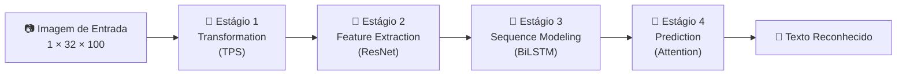
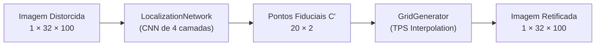
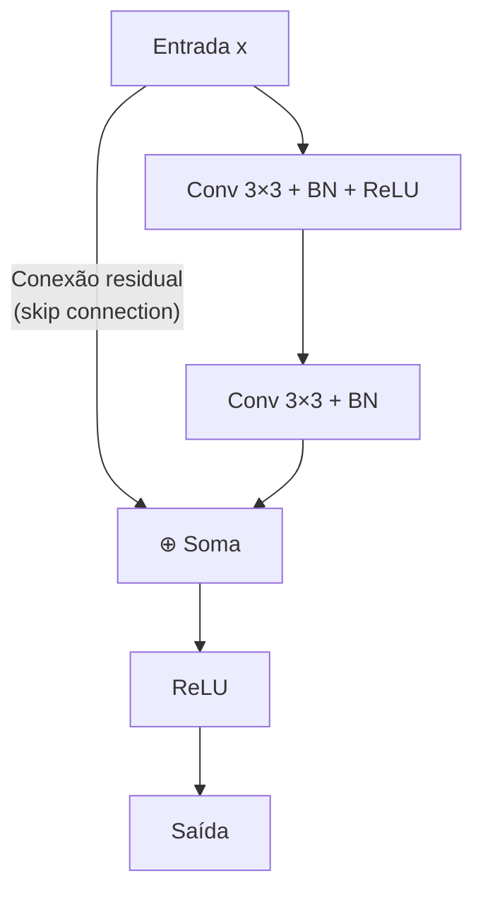
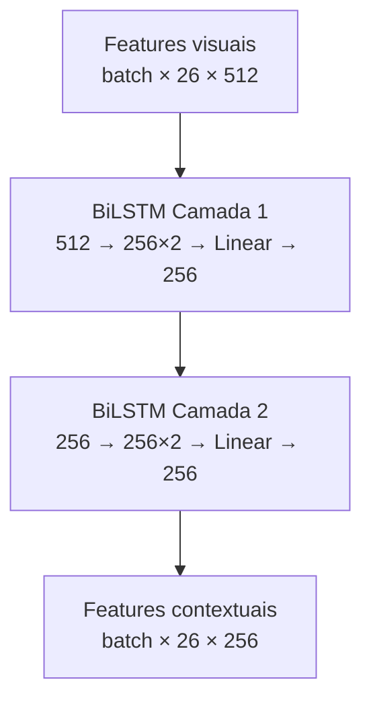
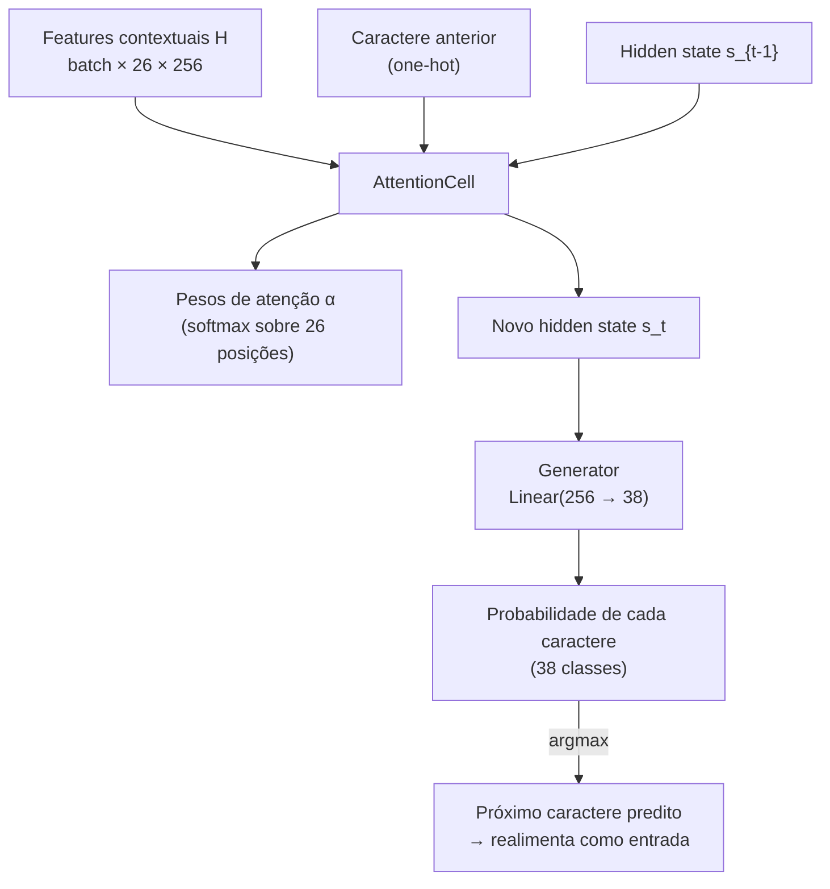
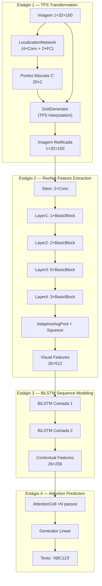

# 🔍 TPS-ResNet-BiLSTM-Attn — Arquitetura do Melhor Modelo

> **TRBA** = **T**PS + **R**esNet + **B**iLSTM + **A**ttn — o modelo de maior acurácia no framework de *Scene Text Recognition* do paper *"What Is Wrong With Scene Text Recognition Model Comparisons?"* (Baek et al., ICCV 2019).

## Resultado obtido no seu dataset

| Dataset | Amostras | Acurácia |
|---|---|---|
| `dados_lmdb_resultado/` | 4.000 | **95.0%** |

---

## Visão Geral do Pipeline

O modelo segue uma arquitetura de **4 estágios sequenciais**, definida em [model.py](file:///home/edge/dev/research/deep-text-recognition-benchmark/model.py):



Cada estágio é um módulo independente e intercambiável. O arquivo [model.py](file:///home/edge/dev/research/deep-text-recognition-benchmark/model.py#L25-L92) orquestra a composição:

```python
# Fluxo do forward (model.py, linhas 70-92)
input = self.Transformation(input)           # Estágio 1: TPS
visual_feature = self.FeatureExtraction(input)  # Estágio 2: ResNet
contextual_feature = self.SequenceModeling(visual_feature)  # Estágio 3: BiLSTM
prediction = self.Prediction(contextual_feature, text, ...)  # Estágio 4: Attention
```

---

## Estágio 1 — Transformation: TPS (Thin Plate Spline)

📄 **Código-fonte**: [transformation.py](file:///home/edge/dev/research/deep-text-recognition-benchmark/modules/transformation.py)

### O que faz?
Retifica a imagem de entrada, corrigindo distorções geométricas como perspectiva e curvatura. Textos em placas fotografados em ângulo são "endireitados" antes de chegar ao restante do modelo.

### Como funciona?



O módulo é composto por **3 sub-componentes**:

### 1.1 — [TPS_SpatialTransformerNetwork](file:///home/edge/dev/research/deep-text-recognition-benchmark/modules/transformation.py#L8-L39)
Classe principal que orquestra a retificação. Utiliza **F = 20 pontos fiduciais** (10 na borda superior, 10 na inferior) para definir a transformação espacial.

### 1.2 — [LocalizationNetwork](file:///home/edge/dev/research/deep-text-recognition-benchmark/modules/transformation.py#L42-L83)
Uma CNN pequena que prediz as coordenadas dos pontos fiduciais a partir da imagem de entrada:

| Camada | Operação | Saída |
|---|---|---|
| Conv1 | Conv2d(1→64, 3×3) + BN + ReLU + MaxPool | 64 × 16 × 50 |
| Conv2 | Conv2d(64→128, 3×3) + BN + ReLU + MaxPool | 128 × 8 × 25 |
| Conv3 | Conv2d(128→256, 3×3) + BN + ReLU + MaxPool | 256 × 4 × 12 |
| Conv4 | Conv2d(256→512, 3×3) + BN + ReLU + AdaptiveAvgPool | 512 |
| FC1 | Linear(512→256) + ReLU | 256 |
| FC2 | Linear(256→40) | F×2 = 40 |

> [!NOTE]
> Os pesos de `FC2` são **inicializados com coordenadas pré-definidas** formando uma grade regular (linhas 64–73 de [transformation.py](file:///home/edge/dev/research/deep-text-recognition-benchmark/modules/transformation.py#L64-L73)). Isso significa que a identidade (sem distorção) é o ponto de partida do treinamento — a rede aprende apenas os **desvios** necessários.

### 1.3 — [GridGenerator](file:///home/edge/dev/research/deep-text-recognition-benchmark/modules/transformation.py#L86-L165)
Calcula a transformação TPS (Thin Plate Spline) usando os pontos fiduciais preditos. A transformação é resolvida como um sistema linear envolvendo funções de base radial (RBF):

$$T = \Delta C^{-1} \cdot C'$$

A grade de pixels resultante é usada via `F.grid_sample()` para produzir a imagem retificada.

---

## Estágio 2 — Feature Extraction: ResNet

📄 **Código-fonte**: [feature_extraction.py](file:///home/edge/dev/research/deep-text-recognition-benchmark/modules/feature_extraction.py)

### O que faz?
Extrai um mapa de features visuais da imagem retificada. Cada coluna do mapa de features corresponde a uma "fatia vertical" da imagem — ou seja, uma posição potencial de caractere.

### Arquitetura

A implementação usa [ResNet_FeatureExtractor](file:///home/edge/dev/research/deep-text-recognition-benchmark/modules/feature_extraction.py#L54-L62) que é baseada no paper FAN. Internamente, instancia a classe [ResNet](file:///home/edge/dev/research/deep-text-recognition-benchmark/modules/feature_extraction.py#L153-L246) com blocos `BasicBlock` na configuração `[1, 2, 5, 3]`:

| Bloco | Camadas | Canais de saída | Resolução espacial |
|---|---|---|---|
| Stem | Conv(1→32) + Conv(32→64) | 64 | 32 × 100 |
| Layer 1 | 1 × BasicBlock + MaxPool | 128 | 16 × 50 |
| Layer 2 | 2 × BasicBlock + MaxPool | 256 | 8 × 25 |
| Layer 3 | 5 × BasicBlock + MaxPool | 512 | 4 × 26 |
| Layer 4 | 3 × BasicBlock + Conv stride | 512 | 1 × 26 |

### [BasicBlock](file:///home/edge/dev/research/deep-text-recognition-benchmark/modules/feature_extraction.py#L117-L150) — Bloco Residual



> [!IMPORTANT]
> A saída do ResNet tem formato `[batch, 512, 1, 26]`. Após `AdaptiveAvgPool` e `squeeze` em [model.py:77-78](file:///home/edge/dev/research/deep-text-recognition-benchmark/model.py#L77-L78), vira `[batch, 26, 512]` — uma sequência de **26 vetores de features de 512 dimensões**, cada um representando uma "coluna" da imagem.

---

## Estágio 3 — Sequence Modeling: BiLSTM

📄 **Código-fonte**: [sequence_modeling.py](file:///home/edge/dev/research/deep-text-recognition-benchmark/modules/sequence_modeling.py)

### O que faz?
Captura **dependências contextuais** entre as colunas de features. Um caractere isolado pode ser ambíguo (ex: "l" vs "1"), mas no contexto de uma palavra, o BiLSTM resolve essas ambiguidades usando informação da vizinhança.

### Arquitetura

São **2 camadas empilhadas** de [BidirectionalLSTM](file:///home/edge/dev/research/deep-text-recognition-benchmark/modules/sequence_modeling.py#L4-L19), configuradas em [model.py:54-56](file:///home/edge/dev/research/deep-text-recognition-benchmark/model.py#L54-L56):



| Parâmetro | Valor |
|---|---|
| `input_size` | 512 (camada 1), 256 (camada 2) |
| `hidden_size` | 256 |
| Bidirecional | ✅ (concatena → 512, depois linear → 256) |

> [!TIP]
> O LSTM bidirecional processa a sequência tanto da esquerda para a direita quanto da direita para a esquerda. Isso permite que cada posição "veja" todo o contexto da palavra — crucial para resolver ambiguidades visuais.

---

## Estágio 4 — Prediction: Attention

📄 **Código-fonte**: [prediction.py](file:///home/edge/dev/research/deep-text-recognition-benchmark/modules/prediction.py)

### O que faz?
Decodifica a sequência de features contextuais em caracteres, um de cada vez, usando um mecanismo de **atenção** que decide automaticamente *onde olhar* na imagem a cada passo.

### Arquitetura



### Componentes internos da [AttentionCell](file:///home/edge/dev/research/deep-text-recognition-benchmark/modules/prediction.py#L61-L81)

| Componente | Operação | Propósito |
|---|---|---|
| `i2h` | Linear(256 → 256, no bias) | Projeta features do encoder H |
| `h2h` | Linear(256 → 256, com bias) | Projeta hidden state do decoder |
| `score` | Linear(256 → 1, no bias) | Calcula score de atenção |
| `rnn` | LSTMCell(256+38 → 256) | Decoder recorrente |

### Fluxo do cálculo de atenção

```python
# AttentionCell.forward (linhas 71-81)
batch_H_proj = self.i2h(batch_H)            # Projeta encoder features
prev_hidden_proj = self.h2h(prev_hidden[0])  # Projeta decoder state
e = self.score(tanh(batch_H_proj + prev_hidden_proj))  # Score de atenção
alpha = softmax(e, dim=1)                    # Pesos normalizados
context = bmm(alpha.T, batch_H)              # Contexto ponderado
cur_hidden = self.rnn([context; char_onehot], prev_hidden)  # Próximo estado
```

> [!NOTE]
> **Treino vs Inferência**: Durante o treino, o caractere correto (*teacher forcing*) é alimentado como entrada a cada passo. Durante a inferência, o caractere predito no passo anterior é usado — decodificação **autoregressiva** (linhas [46-57](file:///home/edge/dev/research/deep-text-recognition-benchmark/modules/prediction.py#L46-L57)).

---

## Resumo dos Parâmetros do Modelo

Os parâmetros padrão são exibidos ao rodar `test.py`: `32 100 20 1 512 256 38 25`

| Parâmetro | Valor | Significado |
|---|---|---|
| `imgH` | 32 | Altura da imagem de entrada |
| `imgW` | 100 | Largura da imagem de entrada |
| `num_fiducial` | 20 | Número de pontos fiduciais do TPS |
| `input_channel` | 1 | Canais de entrada (escala de cinza) |
| `output_channel` | 512 | Canais de saída do feature extractor |
| `hidden_size` | 256 | Dimensão do hidden state do BiLSTM e Attention |
| `num_class` | 38 | Número de classes (a–z + 0–9 + [GO] + [s]) |
| `batch_max_length` | 25 | Comprimento máximo do texto |

---

## Diagrama Completo do Fluxo de Dados



---

## Referências

- **Paper**: [What Is Wrong With Scene Text Recognition Model Comparisons?](https://arxiv.org/abs/1904.01906) — Baek et al., ICCV 2019
- **TPS (RARE)**: [Robust Scene Text Recognition with Automatic Rectification](https://arxiv.org/abs/1603.03915) — Shi et al., CVPR 2016
- **ResNet (FAN)**: [Focusing Attention: Towards Accurate Text Recognition in Natural Images](http://openaccess.thecvf.com/content_ICCV_2017/papers/Cheng_Focusing_Attention_Towards_ICCV_2017_paper.pdf) — Cheng et al., ICCV 2017
