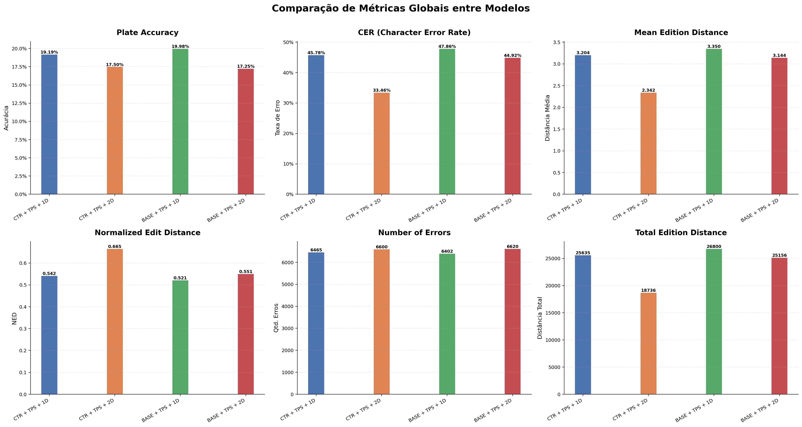
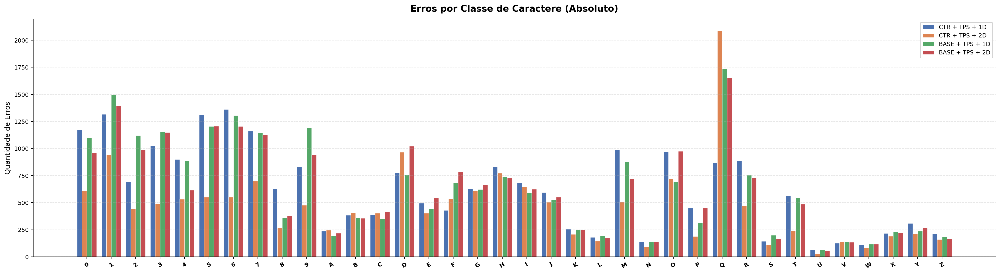
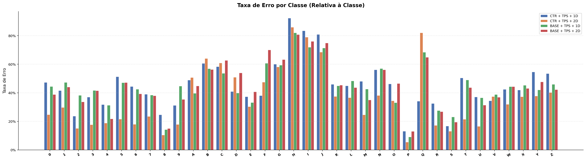
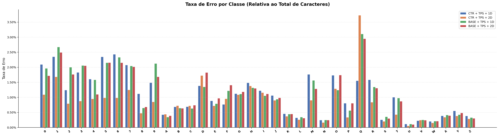
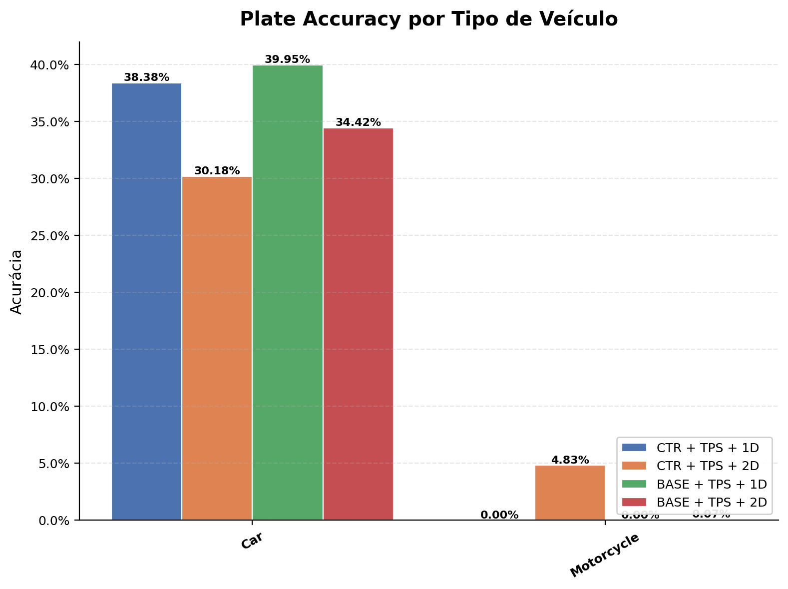
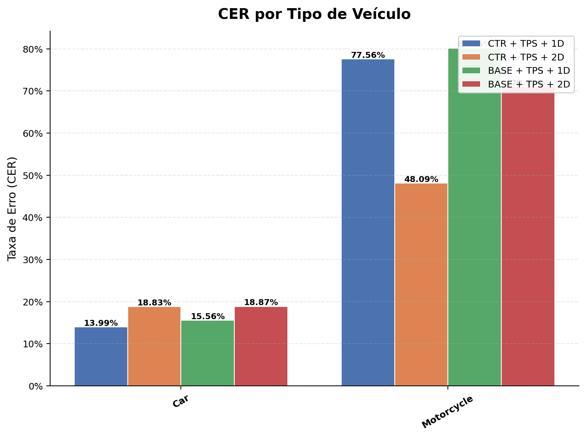
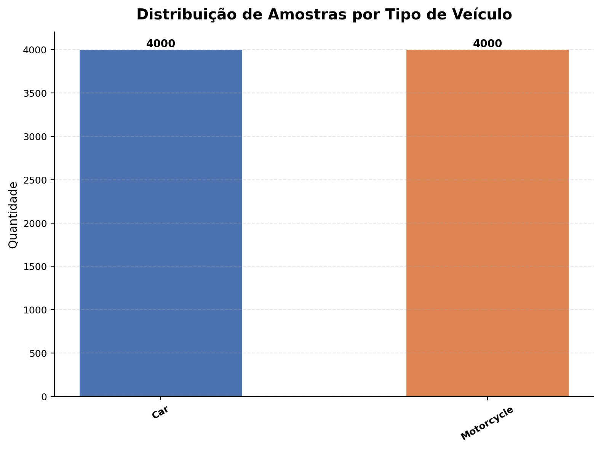

# 📊 Relatório Comparativo de Modelos

**Dataset**: `rodo`  
**Data**: 2026-08-22 21:09:26  
**Modelos avaliados**: 4

---

## 🏷️ Modelos Avaliados

| # | Label | Run ID |
|---|-------|--------|
| 1 | **CTR + TPS + 1D** | `bb029128e334469dabaefee474131cd1` |
| 2 | **CTR + TPS + 2D** | `691231fe325d4c4ba1bb9eab8d24c343` |
| 3 | **BASE + TPS + 1D** | `6d12dea976804d93b709455c468e4dae` |
| 4 | **BASE + TPS + 2D** | `9ab6c40e9b3b45b486d63ad6778ed34e` |

---

## ✅ Plate Accuracy

Proporção de placas reconhecidas corretamente (match exato).

| Modelo | Acertos | Erros | Total | Accuracy |
|--------|---------|-------|-------|----------|
| **CTR + TPS + 1D** | 1535 | 6465 | 8000 | **19.1875%** |
| **CTR + TPS + 2D** | 1400 | 6600 | 8000 | **17.5000%** |
| **BASE + TPS + 1D** | 1598 | 6402 | 8000 | **19.9750%** |
| **BASE + TPS + 2D** | 1380 | 6620 | 8000 | **17.2500%** |

> 🏆 **Melhor modelo**: BASE + TPS + 1D (19.9750%)

---

## 📉 CER (Character Error Rate)

Taxa de erro a nível de caractere (edit distance / total GT chars).

| Modelo | Edit Distance Total | Total GT Chars | CER |
|--------|---------------------|----------------|-----|
| **CTR + TPS + 1D** | 25635 | 56000 | **45.7768%** |
| **CTR + TPS + 2D** | 18736 | 56000 | **33.4571%** |
| **BASE + TPS + 1D** | 26800 | 56000 | **47.8571%** |
| **BASE + TPS + 2D** | 25156 | 56000 | **44.9214%** |

> 🏆 **Melhor modelo**: CTR + TPS + 2D (CER = 33.4571%)

---

## 📏 Edition Distance

Distância de edição Levenshtein entre predição e ground truth.

| Modelo | Total | Média | Normalized ED |
|--------|-------|-------|---------------|
| **CTR + TPS + 1D** | 25635 | 3.2044 | 0.5422 |
| **CTR + TPS + 2D** | 18736 | 2.3420 | 0.6654 |
| **BASE + TPS + 1D** | 26800 | 3.3500 | 0.5214 |
| **BASE + TPS + 2D** | 25156 | 3.1445 | 0.5508 |

> 🏆 **Melhor modelo**: CTR + TPS + 2D (Média = 2.3420)

---

## ❌ Number of Errors

Número de placas com pelo menos um caractere incorreto.

| Modelo | Erros | Total | Taxa de Erro |
|--------|-------|-------|--------------|
| **CTR + TPS + 1D** | 6465 | 8000 | 80.8125% |
| **CTR + TPS + 2D** | 6600 | 8000 | 82.5000% |
| **BASE + TPS + 1D** | 6402 | 8000 | 80.0250% |
| **BASE + TPS + 2D** | 6620 | 8000 | 82.7500% |

> 🏆 **Melhor modelo**: BASE + TPS + 1D (6402 erros)

---

## 🔤 Erros por Classe de Caractere

Contagem absoluta de erros de reconhecimento por classe.

| Char | **CTR + TPS + 1D** | **CTR + TPS + 2D** | **BASE + TPS + 1D** | **BASE + TPS + 2D** |
|------|------|------|------|------|
| **0** | 1172 | 612 | 1100 | 962 |
| **1** | 1317 | 942 | 1497 | 1396 |
| **2** | 695 | 445 | 1121 | 988 |
| **3** | 1025 | 491 | 1154 | 1150 |
| **4** | 901 | 533 | 887 | 617 |
| **5** | 1314 | 552 | 1206 | 1208 |
| **6** | 1363 | 552 | 1307 | 1205 |
| **7** | 1162 | 701 | 1145 | 1131 |
| **8** | 628 | 267 | 362 | 382 |
| **9** | 833 | 476 | 1191 | 943 |
| **A** | 239 | 248 | 194 | 219 |
| **B** | 384 | 406 | 361 | 357 |
| **C** | 386 | 403 | 355 | 415 |
| **D** | 776 | 966 | 757 | 1023 |
| **E** | 497 | 404 | 442 | 543 |
| **F** | 429 | 535 | 684 | 789 |
| **G** | 629 | 609 | 622 | 663 |
| **H** | 832 | 774 | 739 | 728 |
| **I** | 686 | 649 | 591 | 625 |
| **J** | 596 | 505 | 526 | 552 |
| **K** | 255 | 208 | 249 | 252 |
| **L** | 180 | 147 | 194 | 175 |
| **M** | 988 | 506 | 876 | 720 |
| **N** | 137 | 93 | 139 | 137 |
| **O** | 970 | 722 | 695 | 976 |
| **P** | 452 | 190 | 315 | 451 |
| **Q** | 869 | 2089 | 1741 | 1652 |
| **R** | 887 | 471 | 754 | 732 |
| **S** | 144 | 113 | 199 | 168 |
| **T** | 563 | 240 | 547 | 487 |
| **U** | 65 | 29 | 64 | 55 |
| **V** | 126 | 137 | 142 | 135 |
| **W** | 113 | 85 | 118 | 118 |
| **X** | 216 | 192 | 233 | 222 |
| **Y** | 309 | 214 | 238 | 270 |
| **Z** | 214 | 161 | 184 | 169 |

---

## 📊 Taxa de Erro por Classe (Relativa à Classe)

Proporção de caracteres incorretos em relação ao total de ocorrências da classe no GT.

| Char | **CTR + TPS + 1D** | **CTR + TPS + 2D** | **BASE + TPS + 1D** | **BASE + TPS + 2D** |
|------|------|------|------|------|
| **0** | 47.33% | 24.72% | 44.43% | 38.85% |
| **1** | 41.60% | 29.75% | 47.28% | 44.09% |
| **2** | 23.70% | 15.17% | 38.22% | 33.69% |
| **3** | 37.00% | 17.73% | 41.66% | 41.52% |
| **4** | 31.77% | 18.79% | 31.28% | 21.76% |
| **5** | 51.33% | 21.56% | 47.11% | 47.19% |
| **6** | 44.40% | 17.98% | 42.57% | 39.25% |
| **7** | 38.99% | 23.52% | 38.42% | 37.95% |
| **8** | 24.69% | 10.50% | 14.23% | 15.02% |
| **9** | 31.25% | 17.85% | 44.67% | 35.37% |
| **A** | 48.88% | 50.72% | 39.67% | 44.79% |
| **B** | 60.57% | 64.04% | 56.94% | 56.31% |
| **C** | 58.31% | 60.88% | 53.63% | 62.69% |
| **D** | 40.91% | 50.92% | 39.91% | 53.93% |
| **E** | 37.28% | 30.31% | 33.16% | 40.74% |
| **F** | 38.10% | 47.51% | 60.75% | 70.07% |
| **G** | 60.02% | 58.11% | 59.35% | 63.26% |
| **H** | 92.34% | 85.90% | 82.02% | 80.80% |
| **I** | 83.45% | 78.95% | 71.90% | 76.03% |
| **J** | 80.87% | 68.52% | 71.37% | 74.90% |
| **K** | 45.95% | 37.48% | 44.86% | 45.41% |
| **L** | 44.89% | 36.66% | 48.38% | 43.64% |
| **M** | 48.03% | 24.60% | 42.59% | 35.00% |
| **N** | 56.15% | 38.11% | 56.97% | 56.15% |
| **O** | 46.21% | 34.40% | 33.11% | 46.50% |
| **P** | 13.08% | 5.50% | 9.12% | 13.05% |
| **Q** | 34.13% | 82.05% | 68.38% | 64.89% |
| **R** | 32.50% | 17.26% | 27.63% | 26.82% |
| **S** | 16.74% | 13.14% | 23.14% | 19.53% |
| **T** | 50.45% | 21.51% | 49.01% | 43.64% |
| **U** | 37.14% | 16.57% | 36.57% | 31.43% |
| **V** | 34.43% | 37.43% | 38.80% | 36.89% |
| **W** | 42.48% | 31.95% | 44.36% | 44.36% |
| **X** | 41.94% | 37.28% | 45.24% | 43.11% |
| **Y** | 54.59% | 37.81% | 42.05% | 47.70% |
| **Z** | 53.50% | 40.25% | 46.00% | 42.25% |

---

## 📊 Taxa de Erro por Classe (Relativa ao Total de Caracteres)

Proporção de erros da classe em relação ao total de caracteres do GT.

| Char | **CTR + TPS + 1D** | **CTR + TPS + 2D** | **BASE + TPS + 1D** | **BASE + TPS + 2D** |
|------|------|------|------|------|
| **0** | 2.0929% | 1.0929% | 1.9643% | 1.7179% |
| **1** | 2.3518% | 1.6821% | 2.6732% | 2.4929% |
| **2** | 1.2411% | 0.7946% | 2.0018% | 1.7643% |
| **3** | 1.8304% | 0.8768% | 2.0607% | 2.0536% |
| **4** | 1.6089% | 0.9518% | 1.5839% | 1.1018% |
| **5** | 2.3464% | 0.9857% | 2.1536% | 2.1571% |
| **6** | 2.4339% | 0.9857% | 2.3339% | 2.1518% |
| **7** | 2.0750% | 1.2518% | 2.0446% | 2.0196% |
| **8** | 1.1214% | 0.4768% | 0.6464% | 0.6821% |
| **9** | 1.4875% | 0.8500% | 2.1268% | 1.6839% |
| **A** | 0.4268% | 0.4429% | 0.3464% | 0.3911% |
| **B** | 0.6857% | 0.7250% | 0.6446% | 0.6375% |
| **C** | 0.6893% | 0.7196% | 0.6339% | 0.7411% |
| **D** | 1.3857% | 1.7250% | 1.3518% | 1.8268% |
| **E** | 0.8875% | 0.7214% | 0.7893% | 0.9696% |
| **F** | 0.7661% | 0.9554% | 1.2214% | 1.4089% |
| **G** | 1.1232% | 1.0875% | 1.1107% | 1.1839% |
| **H** | 1.4857% | 1.3821% | 1.3196% | 1.3000% |
| **I** | 1.2250% | 1.1589% | 1.0554% | 1.1161% |
| **J** | 1.0643% | 0.9018% | 0.9393% | 0.9857% |
| **K** | 0.4554% | 0.3714% | 0.4446% | 0.4500% |
| **L** | 0.3214% | 0.2625% | 0.3464% | 0.3125% |
| **M** | 1.7643% | 0.9036% | 1.5643% | 1.2857% |
| **N** | 0.2446% | 0.1661% | 0.2482% | 0.2446% |
| **O** | 1.7321% | 1.2893% | 1.2411% | 1.7429% |
| **P** | 0.8071% | 0.3393% | 0.5625% | 0.8054% |
| **Q** | 1.5518% | 3.7304% | 3.1089% | 2.9500% |
| **R** | 1.5839% | 0.8411% | 1.3464% | 1.3071% |
| **S** | 0.2571% | 0.2018% | 0.3554% | 0.3000% |
| **T** | 1.0054% | 0.4286% | 0.9768% | 0.8696% |
| **U** | 0.1161% | 0.0518% | 0.1143% | 0.0982% |
| **V** | 0.2250% | 0.2446% | 0.2536% | 0.2411% |
| **W** | 0.2018% | 0.1518% | 0.2107% | 0.2107% |
| **X** | 0.3857% | 0.3429% | 0.4161% | 0.3964% |
| **Y** | 0.5518% | 0.3821% | 0.4250% | 0.4821% |
| **Z** | 0.3821% | 0.2875% | 0.3286% | 0.3018% |

---

## 🏅 Resumo Geral

| Métrica | Melhor Modelo | Valor |
|---------|---------------|-------|
| Plate Accuracy | **BASE + TPS + 1D** | 19.9750% |
| CER | **CTR + TPS + 2D** | 33.4571% |
| Mean Edit Distance | **CTR + TPS + 2D** | 2.3420 |
| Normalized ED | **CTR + TPS + 2D** | 0.6654 |
| N. Erros | **BASE + TPS + 1D** | 6402 |

---

## 🚗 Análise por Tipo de Veículo

Acurácia e métricas discriminadas por tipo de veículo (mapeamento: `dataset/vehicle_mapping.csv`).

### Plate Accuracy por Tipo de Veículo

| Modelo |**Car** | **Motorcycle** |
|--------|--------|--------|
| **CTR + TPS + 1D** | 38.3750% (1535/4000) | 0.0000% (0/4000) |
| **CTR + TPS + 2D** | 30.1750% (1207/4000) | 4.8250% (193/4000) |
| **BASE + TPS + 1D** | 39.9500% (1598/4000) | 0.0000% (0/4000) |
| **BASE + TPS + 2D** | 34.4250% (1377/4000) | 0.0750% (3/4000) |

### CER por Tipo de Veículo

| Modelo |**Car** | **Motorcycle** |
|--------|--------|--------|
| **CTR + TPS + 1D** | 13.9893% | 77.5643% |
| **CTR + TPS + 2D** | 18.8286% | 48.0857% |
| **BASE + TPS + 1D** | 15.5643% | 80.1500% |
| **BASE + TPS + 2D** | 18.8714% | 70.9714% |

### Detalhamento por Tipo de Veículo

#### Car

| Modelo | Acertos | Erros | Total | Accuracy | CER | MED | NED |
|--------|---------|-------|-------|----------|-----|-----|-----|
| **CTR + TPS + 1D** | 1535 | 2465 | 4000 | **38.3750%** | 13.9893% | 0.9792 | 0.8601 |
| **CTR + TPS + 2D** | 1207 | 2793 | 4000 | **30.1750%** | 18.8286% | 1.3180 | 0.8117 |
| **BASE + TPS + 1D** | 1598 | 2402 | 4000 | **39.9500%** | 15.5643% | 1.0895 | 0.8444 |
| **BASE + TPS + 2D** | 1377 | 2623 | 4000 | **34.4250%** | 18.8714% | 1.3210 | 0.8113 |

#### Motorcycle

| Modelo | Acertos | Erros | Total | Accuracy | CER | MED | NED |
|--------|---------|-------|-------|----------|-----|-----|-----|
| **CTR + TPS + 1D** | 0 | 4000 | 4000 | **0.0000%** | 77.5643% | 5.4295 | 0.2244 |
| **CTR + TPS + 2D** | 193 | 3807 | 4000 | **4.8250%** | 48.0857% | 3.3660 | 0.5191 |
| **BASE + TPS + 1D** | 0 | 4000 | 4000 | **0.0000%** | 80.1500% | 5.6105 | 0.1985 |
| **BASE + TPS + 2D** | 3 | 3997 | 4000 | **0.0750%** | 70.9714% | 4.9680 | 0.2903 |

### 🏆 Melhor Modelo por Tipo de Veículo

| Tipo | Melhor Modelo | Accuracy |
|------|---------------|----------|
| **Car** | **BASE + TPS + 1D** | 39.9500% |
| **Motorcycle** | **CTR + TPS + 2D** | 4.8250% |

---

## 📈 Gráficos

### Métricas Globais

### Erros por Classe (Absoluto)

### Taxa de Erro por Classe (Relativa à Classe)

### Taxa de Erro por Classe (Relativa ao Total)

### Acurácia por Tipo de Veículo

### CER por Tipo de Veículo

### Distribuição de Amostras por Tipo de Veículo

