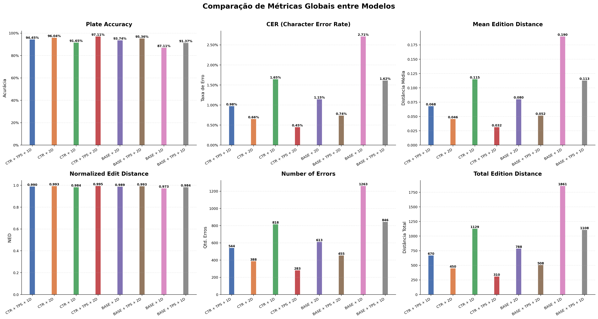
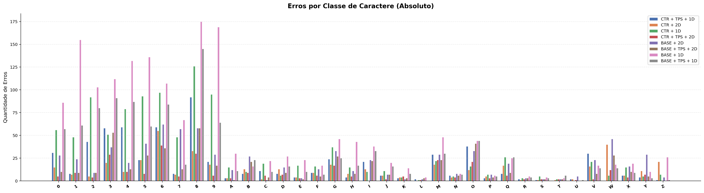
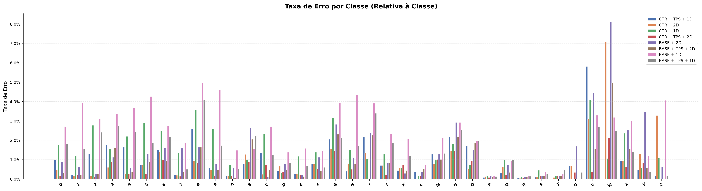
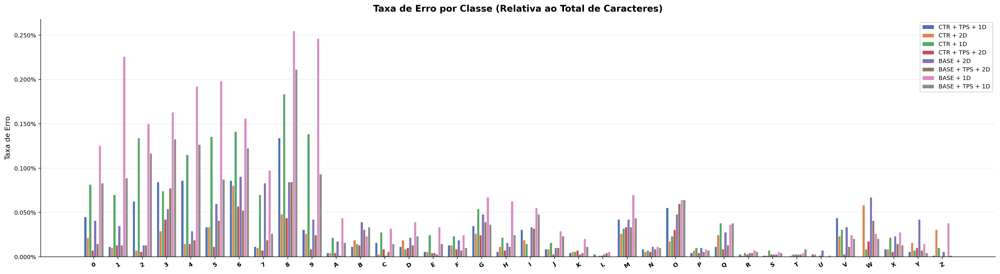
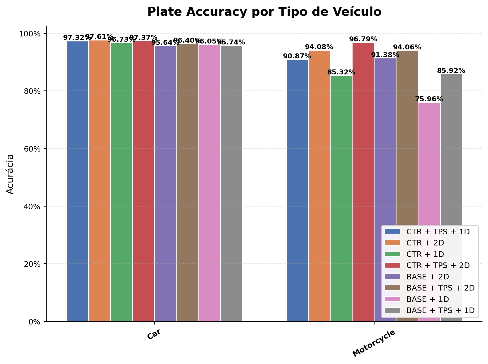
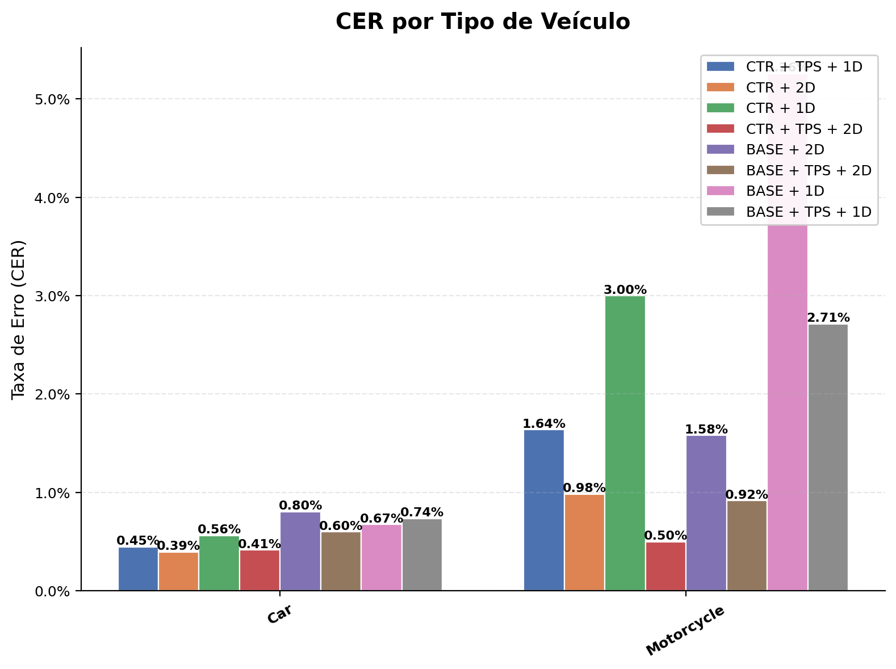
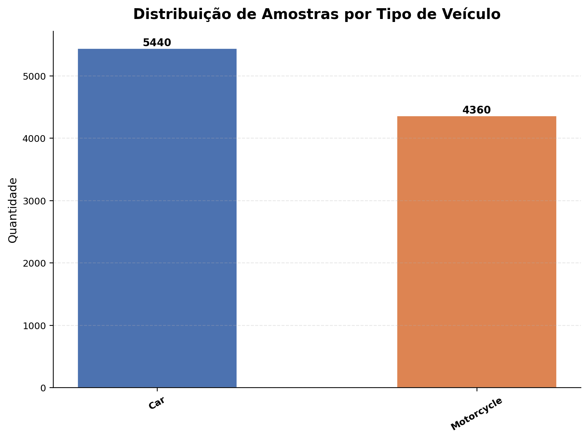

# 📊 Relatório Comparativo de Modelos

**Dataset**: `rodo_ufpr`  
**Data**: 2026-08-22 20:05:09  
**Modelos avaliados**: 8

---

## 🏷️ Modelos Avaliados

| # | Label | Run ID |
|---|-------|--------|
| 1 | **CTR + TPS + 1D** | `21f5c3592f234b2db13fedb17a27427e` |
| 2 | **CTR + 2D** | `244cd7823c6a4c3f98ebca50d22ee6b6` |
| 3 | **CTR + 1D** | `4303cfd894ce4ec893264a32e8d28928` |
| 4 | **CTR + TPS + 2D** | `4417bd02df8e421ab9e54cb4f144cf76` |
| 5 | **BASE + 2D** | `84681ead5d8c4b9396555aaa4cacc156` |
| 6 | **BASE + TPS + 2D** | `8661db20381847d18da5d6a32cf03b58` |
| 7 | **BASE + 1D** | `878279ffc06549529ac3e8ee4e1c8f31` |
| 8 | **BASE + TPS + 1D** | `e4e5e0139b8d4b5f858d727854407ef2` |

---

## ✅ Plate Accuracy

Proporção de placas reconhecidas corretamente (match exato).

| Modelo | Acertos | Erros | Total | Accuracy |
|--------|---------|-------|-------|----------|
| **CTR + TPS + 1D** | 9256 | 544 | 9800 | **94.4490%** |
| **CTR + 2D** | 9412 | 388 | 9800 | **96.0408%** |
| **CTR + 1D** | 8982 | 818 | 9800 | **91.6531%** |
| **CTR + TPS + 2D** | 9517 | 283 | 9800 | **97.1122%** |
| **BASE + 2D** | 9187 | 613 | 9800 | **93.7449%** |
| **BASE + TPS + 2D** | 9345 | 455 | 9800 | **95.3571%** |
| **BASE + 1D** | 8537 | 1263 | 9800 | **87.1122%** |
| **BASE + TPS + 1D** | 8954 | 846 | 9800 | **91.3673%** |

> 🏆 **Melhor modelo**: CTR + TPS + 2D (97.1122%)

---

## 📉 CER (Character Error Rate)

Taxa de erro a nível de caractere (edit distance / total GT chars).

| Modelo | Edit Distance Total | Total GT Chars | CER |
|--------|---------------------|----------------|-----|
| **CTR + TPS + 1D** | 670 | 68600 | **0.9767%** |
| **CTR + 2D** | 450 | 68600 | **0.6560%** |
| **CTR + 1D** | 1129 | 68600 | **1.6458%** |
| **CTR + TPS + 2D** | 310 | 68600 | **0.4519%** |
| **BASE + 2D** | 788 | 68600 | **1.1487%** |
| **BASE + TPS + 2D** | 508 | 68600 | **0.7405%** |
| **BASE + 1D** | 1861 | 68600 | **2.7128%** |
| **BASE + TPS + 1D** | 1108 | 68600 | **1.6152%** |

> 🏆 **Melhor modelo**: CTR + TPS + 2D (CER = 0.4519%)

---

## 📏 Edition Distance

Distância de edição Levenshtein entre predição e ground truth.

| Modelo | Total | Média | Normalized ED |
|--------|-------|-------|---------------|
| **CTR + TPS + 1D** | 670 | 0.0684 | 0.9902 |
| **CTR + 2D** | 450 | 0.0459 | 0.9934 |
| **CTR + 1D** | 1129 | 0.1152 | 0.9835 |
| **CTR + TPS + 2D** | 310 | 0.0316 | 0.9955 |
| **BASE + 2D** | 788 | 0.0804 | 0.9885 |
| **BASE + TPS + 2D** | 508 | 0.0518 | 0.9926 |
| **BASE + 1D** | 1861 | 0.1899 | 0.9729 |
| **BASE + TPS + 1D** | 1108 | 0.1131 | 0.9838 |

> 🏆 **Melhor modelo**: CTR + TPS + 2D (Média = 0.0316)

---

## ❌ Number of Errors

Número de placas com pelo menos um caractere incorreto.

| Modelo | Erros | Total | Taxa de Erro |
|--------|-------|-------|--------------|
| **CTR + TPS + 1D** | 544 | 9800 | 5.5510% |
| **CTR + 2D** | 388 | 9800 | 3.9592% |
| **CTR + 1D** | 818 | 9800 | 8.3469% |
| **CTR + TPS + 2D** | 283 | 9800 | 2.8878% |
| **BASE + 2D** | 613 | 9800 | 6.2551% |
| **BASE + TPS + 2D** | 455 | 9800 | 4.6429% |
| **BASE + 1D** | 1263 | 9800 | 12.8878% |
| **BASE + TPS + 1D** | 846 | 9800 | 8.6327% |

> 🏆 **Melhor modelo**: CTR + TPS + 2D (283 erros)

---

## 🔤 Erros por Classe de Caractere

Contagem absoluta de erros de reconhecimento por classe.

| Char | **CTR + TPS + 1D** | **CTR + 2D** | **CTR + 1D** | **CTR + TPS + 2D** | **BASE + 2D** | **BASE + TPS + 2D** | **BASE + 1D** | **BASE + TPS + 1D** |
|------|------|------|------|------|------|------|------|------|
| **0** | 31 | 15 | 56 | 5 | 28 | 10 | 86 | 57 |
| **1** | 8 | 7 | 48 | 9 | 24 | 9 | 155 | 61 |
| **2** | 43 | 5 | 92 | 4 | 9 | 9 | 103 | 80 |
| **3** | 58 | 20 | 51 | 29 | 37 | 53 | 112 | 91 |
| **4** | 59 | 10 | 79 | 10 | 20 | 13 | 132 | 87 |
| **5** | 23 | 23 | 93 | 8 | 41 | 28 | 136 | 60 |
| **6** | 59 | 55 | 97 | 39 | 62 | 36 | 107 | 84 |
| **7** | 8 | 7 | 48 | 5 | 57 | 13 | 67 | 18 |
| **8** | 92 | 33 | 126 | 30 | 58 | 58 | 175 | 145 |
| **9** | 21 | 18 | 95 | 6 | 29 | 17 | 169 | 64 |
| **A** | 3 | 3 | 15 | 3 | 12 | 1 | 30 | 11 |
| **B** | 8 | 13 | 10 | 9 | 27 | 21 | 16 | 23 |
| **C** | 11 | 2 | 19 | 6 | 1 | 4 | 22 | 10 |
| **D** | 8 | 13 | 6 | 7 | 15 | 9 | 27 | 16 |
| **E** | 4 | 4 | 17 | 3 | 3 | 2 | 23 | 10 |
| **F** | 9 | 9 | 16 | 6 | 13 | 5 | 17 | 7 |
| **G** | 24 | 18 | 37 | 17 | 33 | 27 | 46 | 25 |
| **H** | 4 | 8 | 15 | 5 | 11 | 8 | 43 | 17 |
| **I** | 21 | 13 | 10 | 0 | 23 | 22 | 38 | 33 |
| **J** | 6 | 6 | 11 | 2 | 7 | 7 | 20 | 16 |
| **K** | 3 | 4 | 4 | 5 | 2 | 3 | 14 | 8 |
| **L** | 2 | 0 | 1 | 1 | 2 | 3 | 4 | 0 |
| **M** | 29 | 18 | 22 | 23 | 29 | 23 | 48 | 30 |
| **N** | 6 | 4 | 5 | 4 | 8 | 6 | 8 | 7 |
| **O** | 38 | 12 | 16 | 21 | 33 | 41 | 44 | 44 |
| **P** | 3 | 5 | 7 | 3 | 7 | 4 | 6 | 5 |
| **Q** | 8 | 17 | 26 | 6 | 19 | 9 | 25 | 26 |
| **R** | 2 | 1 | 3 | 2 | 3 | 3 | 5 | 4 |
| **S** | 1 | 1 | 5 | 2 | 2 | 2 | 4 | 3 |
| **T** | 0 | 1 | 2 | 2 | 2 | 2 | 3 | 6 |
| **U** | 2 | 2 | 0 | 1 | 5 | 0 | 0 | 1 |
| **V** | 30 | 16 | 21 | 2 | 23 | 8 | 17 | 14 |
| **W** | 0 | 40 | 6 | 12 | 46 | 28 | 18 | 14 |
| **X** | 6 | 6 | 15 | 4 | 16 | 10 | 19 | 9 |
| **Y** | 4 | 11 | 5 | 7 | 29 | 5 | 10 | 3 |
| **Z** | 1 | 21 | 7 | 0 | 4 | 0 | 26 | 1 |

---

## 📊 Taxa de Erro por Classe (Relativa à Classe)

Proporção de caracteres incorretos em relação ao total de ocorrências da classe no GT.

| Char | **CTR + TPS + 1D** | **CTR + 2D** | **CTR + 1D** | **CTR + TPS + 2D** | **BASE + 2D** | **BASE + TPS + 2D** | **BASE + 1D** | **BASE + TPS + 1D** |
|------|------|------|------|------|------|------|------|------|
| **0** | 0.98% | 0.47% | 1.77% | 0.16% | 0.88% | 0.32% | 2.72% | 1.80% |
| **1** | 0.20% | 0.18% | 1.22% | 0.23% | 0.61% | 0.23% | 3.93% | 1.55% |
| **2** | 1.29% | 0.15% | 2.77% | 0.12% | 0.27% | 0.27% | 3.10% | 2.41% |
| **3** | 1.75% | 0.60% | 1.54% | 0.88% | 1.12% | 1.60% | 3.38% | 2.75% |
| **4** | 1.65% | 0.28% | 2.20% | 0.28% | 0.56% | 0.36% | 3.68% | 2.43% |
| **5** | 0.72% | 0.72% | 2.92% | 0.25% | 1.29% | 0.88% | 4.26% | 1.88% |
| **6** | 1.52% | 1.42% | 2.50% | 1.01% | 1.60% | 0.93% | 2.76% | 2.16% |
| **7** | 0.22% | 0.20% | 1.34% | 0.14% | 1.59% | 0.36% | 1.87% | 0.50% |
| **8** | 2.60% | 0.93% | 3.57% | 0.85% | 1.64% | 1.64% | 4.95% | 4.10% |
| **9** | 0.57% | 0.49% | 2.58% | 0.16% | 0.79% | 0.46% | 4.58% | 1.74% |
| **A** | 0.15% | 0.15% | 0.74% | 0.15% | 0.59% | 0.05% | 1.49% | 0.54% |
| **B** | 0.78% | 1.27% | 0.98% | 0.88% | 2.64% | 2.05% | 1.56% | 2.25% |
| **C** | 1.35% | 0.25% | 2.34% | 0.74% | 0.12% | 0.49% | 2.71% | 1.23% |
| **D** | 0.41% | 0.66% | 0.31% | 0.36% | 0.77% | 0.46% | 1.38% | 0.82% |
| **E** | 0.28% | 0.28% | 1.17% | 0.21% | 0.21% | 0.14% | 1.58% | 0.69% |
| **F** | 0.78% | 0.78% | 1.38% | 0.52% | 1.12% | 0.43% | 1.47% | 0.61% |
| **G** | 2.05% | 1.54% | 3.17% | 1.46% | 2.83% | 2.31% | 3.94% | 2.14% |
| **H** | 0.40% | 0.81% | 1.51% | 0.50% | 1.11% | 0.81% | 4.34% | 1.72% |
| **I** | 2.16% | 1.34% | 1.03% | 0.00% | 2.37% | 2.26% | 3.91% | 3.40% |
| **J** | 0.70% | 0.70% | 1.28% | 0.23% | 0.82% | 0.82% | 2.33% | 1.87% |
| **K** | 0.44% | 0.59% | 0.59% | 0.74% | 0.30% | 0.44% | 2.07% | 1.19% |
| **L** | 0.36% | 0.00% | 0.18% | 0.18% | 0.36% | 0.54% | 0.73% | 0.00% |
| **M** | 1.28% | 0.79% | 0.97% | 1.01% | 1.28% | 1.01% | 2.12% | 1.32% |
| **N** | 2.19% | 1.46% | 1.82% | 1.46% | 2.92% | 2.19% | 2.92% | 2.55% |
| **O** | 1.71% | 0.54% | 0.72% | 0.95% | 1.49% | 1.85% | 1.98% | 1.98% |
| **P** | 0.08% | 0.13% | 0.19% | 0.08% | 0.19% | 0.11% | 0.16% | 0.13% |
| **Q** | 0.30% | 0.64% | 0.99% | 0.23% | 0.72% | 0.34% | 0.95% | 0.99% |
| **R** | 0.07% | 0.04% | 0.11% | 0.07% | 0.11% | 0.11% | 0.18% | 0.14% |
| **S** | 0.09% | 0.09% | 0.45% | 0.18% | 0.18% | 0.18% | 0.36% | 0.27% |
| **T** | 0.00% | 0.08% | 0.17% | 0.17% | 0.17% | 0.17% | 0.25% | 0.50% |
| **U** | 0.68% | 0.68% | 0.00% | 0.34% | 1.69% | 0.00% | 0.00% | 0.34% |
| **V** | 5.81% | 3.10% | 4.07% | 0.39% | 4.46% | 1.55% | 3.29% | 2.71% |
| **W** | 0.00% | 7.07% | 1.06% | 2.12% | 8.13% | 4.95% | 3.18% | 2.47% |
| **X** | 0.94% | 0.94% | 2.36% | 0.63% | 2.52% | 1.57% | 2.99% | 1.42% |
| **Y** | 0.48% | 1.32% | 0.60% | 0.84% | 3.47% | 0.60% | 1.20% | 0.36% |
| **Z** | 0.16% | 3.28% | 1.09% | 0.00% | 0.62% | 0.00% | 4.06% | 0.16% |

---

## 📊 Taxa de Erro por Classe (Relativa ao Total de Caracteres)

Proporção de erros da classe em relação ao total de caracteres do GT.

| Char | **CTR + TPS + 1D** | **CTR + 2D** | **CTR + 1D** | **CTR + TPS + 2D** | **BASE + 2D** | **BASE + TPS + 2D** | **BASE + 1D** | **BASE + TPS + 1D** |
|------|------|------|------|------|------|------|------|------|
| **0** | 0.0452% | 0.0219% | 0.0816% | 0.0073% | 0.0408% | 0.0146% | 0.1254% | 0.0831% |
| **1** | 0.0117% | 0.0102% | 0.0700% | 0.0131% | 0.0350% | 0.0131% | 0.2259% | 0.0889% |
| **2** | 0.0627% | 0.0073% | 0.1341% | 0.0058% | 0.0131% | 0.0131% | 0.1501% | 0.1166% |
| **3** | 0.0845% | 0.0292% | 0.0743% | 0.0423% | 0.0539% | 0.0773% | 0.1633% | 0.1327% |
| **4** | 0.0860% | 0.0146% | 0.1152% | 0.0146% | 0.0292% | 0.0190% | 0.1924% | 0.1268% |
| **5** | 0.0335% | 0.0335% | 0.1356% | 0.0117% | 0.0598% | 0.0408% | 0.1983% | 0.0875% |
| **6** | 0.0860% | 0.0802% | 0.1414% | 0.0569% | 0.0904% | 0.0525% | 0.1560% | 0.1224% |
| **7** | 0.0117% | 0.0102% | 0.0700% | 0.0073% | 0.0831% | 0.0190% | 0.0977% | 0.0262% |
| **8** | 0.1341% | 0.0481% | 0.1837% | 0.0437% | 0.0845% | 0.0845% | 0.2551% | 0.2114% |
| **9** | 0.0306% | 0.0262% | 0.1385% | 0.0087% | 0.0423% | 0.0248% | 0.2464% | 0.0933% |
| **A** | 0.0044% | 0.0044% | 0.0219% | 0.0044% | 0.0175% | 0.0015% | 0.0437% | 0.0160% |
| **B** | 0.0117% | 0.0190% | 0.0146% | 0.0131% | 0.0394% | 0.0306% | 0.0233% | 0.0335% |
| **C** | 0.0160% | 0.0029% | 0.0277% | 0.0087% | 0.0015% | 0.0058% | 0.0321% | 0.0146% |
| **D** | 0.0117% | 0.0190% | 0.0087% | 0.0102% | 0.0219% | 0.0131% | 0.0394% | 0.0233% |
| **E** | 0.0058% | 0.0058% | 0.0248% | 0.0044% | 0.0044% | 0.0029% | 0.0335% | 0.0146% |
| **F** | 0.0131% | 0.0131% | 0.0233% | 0.0087% | 0.0190% | 0.0073% | 0.0248% | 0.0102% |
| **G** | 0.0350% | 0.0262% | 0.0539% | 0.0248% | 0.0481% | 0.0394% | 0.0671% | 0.0364% |
| **H** | 0.0058% | 0.0117% | 0.0219% | 0.0073% | 0.0160% | 0.0117% | 0.0627% | 0.0248% |
| **I** | 0.0306% | 0.0190% | 0.0146% | 0.0000% | 0.0335% | 0.0321% | 0.0554% | 0.0481% |
| **J** | 0.0087% | 0.0087% | 0.0160% | 0.0029% | 0.0102% | 0.0102% | 0.0292% | 0.0233% |
| **K** | 0.0044% | 0.0058% | 0.0058% | 0.0073% | 0.0029% | 0.0044% | 0.0204% | 0.0117% |
| **L** | 0.0029% | 0.0000% | 0.0015% | 0.0015% | 0.0029% | 0.0044% | 0.0058% | 0.0000% |
| **M** | 0.0423% | 0.0262% | 0.0321% | 0.0335% | 0.0423% | 0.0335% | 0.0700% | 0.0437% |
| **N** | 0.0087% | 0.0058% | 0.0073% | 0.0058% | 0.0117% | 0.0087% | 0.0117% | 0.0102% |
| **O** | 0.0554% | 0.0175% | 0.0233% | 0.0306% | 0.0481% | 0.0598% | 0.0641% | 0.0641% |
| **P** | 0.0044% | 0.0073% | 0.0102% | 0.0044% | 0.0102% | 0.0058% | 0.0087% | 0.0073% |
| **Q** | 0.0117% | 0.0248% | 0.0379% | 0.0087% | 0.0277% | 0.0131% | 0.0364% | 0.0379% |
| **R** | 0.0029% | 0.0015% | 0.0044% | 0.0029% | 0.0044% | 0.0044% | 0.0073% | 0.0058% |
| **S** | 0.0015% | 0.0015% | 0.0073% | 0.0029% | 0.0029% | 0.0029% | 0.0058% | 0.0044% |
| **T** | 0.0000% | 0.0015% | 0.0029% | 0.0029% | 0.0029% | 0.0029% | 0.0044% | 0.0087% |
| **U** | 0.0029% | 0.0029% | 0.0000% | 0.0015% | 0.0073% | 0.0000% | 0.0000% | 0.0015% |
| **V** | 0.0437% | 0.0233% | 0.0306% | 0.0029% | 0.0335% | 0.0117% | 0.0248% | 0.0204% |
| **W** | 0.0000% | 0.0583% | 0.0087% | 0.0175% | 0.0671% | 0.0408% | 0.0262% | 0.0204% |
| **X** | 0.0087% | 0.0087% | 0.0219% | 0.0058% | 0.0233% | 0.0146% | 0.0277% | 0.0131% |
| **Y** | 0.0058% | 0.0160% | 0.0073% | 0.0102% | 0.0423% | 0.0073% | 0.0146% | 0.0044% |
| **Z** | 0.0015% | 0.0306% | 0.0102% | 0.0000% | 0.0058% | 0.0000% | 0.0379% | 0.0015% |

---

## 🏅 Resumo Geral

| Métrica | Melhor Modelo | Valor |
|---------|---------------|-------|
| Plate Accuracy | **CTR + TPS + 2D** | 97.1122% |
| CER | **CTR + TPS + 2D** | 0.4519% |
| Mean Edit Distance | **CTR + TPS + 2D** | 0.0316 |
| Normalized ED | **CTR + TPS + 2D** | 0.9955 |
| N. Erros | **CTR + TPS + 2D** | 283 |

---

## 🚗 Análise por Tipo de Veículo

Acurácia e métricas discriminadas por tipo de veículo (mapeamento: `dataset/vehicle_mapping.csv`).

### Plate Accuracy por Tipo de Veículo

| Modelo |**Car** | **Motorcycle** |
|--------|--------|--------|
| **CTR + TPS + 1D** | 97.3162% (5294/5440) | 90.8716% (3962/4360) |
| **CTR + 2D** | 97.6103% (5310/5440) | 94.0826% (4102/4360) |
| **CTR + 1D** | 96.7279% (5262/5440) | 85.3211% (3720/4360) |
| **CTR + TPS + 2D** | 97.3713% (5297/5440) | 96.7890% (4220/4360) |
| **BASE + 2D** | 95.6434% (5203/5440) | 91.3761% (3984/4360) |
| **BASE + TPS + 2D** | 96.3971% (5244/5440) | 94.0596% (4101/4360) |
| **BASE + 1D** | 96.0478% (5225/5440) | 75.9633% (3312/4360) |
| **BASE + TPS + 1D** | 95.7353% (5208/5440) | 85.9174% (3746/4360) |

### CER por Tipo de Veículo

| Modelo |**Car** | **Motorcycle** |
|--------|--------|--------|
| **CTR + TPS + 1D** | 0.4464% | 1.6383% |
| **CTR + 2D** | 0.3939% | 0.9830% |
| **CTR + 1D** | 0.5620% | 2.9980% |
| **CTR + TPS + 2D** | 0.4149% | 0.4980% |
| **BASE + 2D** | 0.8036% | 1.5793% |
| **BASE + TPS + 2D** | 0.5987% | 0.9174% |
| **BASE + 1D** | 0.6749% | 5.2556% |
| **BASE + TPS + 1D** | 0.7353% | 2.7130% |

### Detalhamento por Tipo de Veículo

#### Car

| Modelo | Acertos | Erros | Total | Accuracy | CER | MED | NED |
|--------|---------|-------|-------|----------|-----|-----|-----|
| **CTR + TPS + 1D** | 5294 | 146 | 5440 | **97.3162%** | 0.4464% | 0.0312 | 0.9955 |
| **CTR + 2D** | 5310 | 130 | 5440 | **97.6103%** | 0.3939% | 0.0276 | 0.9961 |
| **CTR + 1D** | 5262 | 178 | 5440 | **96.7279%** | 0.5620% | 0.0393 | 0.9944 |
| **CTR + TPS + 2D** | 5297 | 143 | 5440 | **97.3713%** | 0.4149% | 0.0290 | 0.9959 |
| **BASE + 2D** | 5203 | 237 | 5440 | **95.6434%** | 0.8036% | 0.0563 | 0.9920 |
| **BASE + TPS + 2D** | 5244 | 196 | 5440 | **96.3971%** | 0.5987% | 0.0419 | 0.9940 |
| **BASE + 1D** | 5225 | 215 | 5440 | **96.0478%** | 0.6749% | 0.0472 | 0.9933 |
| **BASE + TPS + 1D** | 5208 | 232 | 5440 | **95.7353%** | 0.7353% | 0.0515 | 0.9926 |

#### Motorcycle

| Modelo | Acertos | Erros | Total | Accuracy | CER | MED | NED |
|--------|---------|-------|-------|----------|-----|-----|-----|
| **CTR + TPS + 1D** | 3962 | 398 | 4360 | **90.8716%** | 1.6383% | 0.1147 | 0.9836 |
| **CTR + 2D** | 4102 | 258 | 4360 | **94.0826%** | 0.9830% | 0.0688 | 0.9902 |
| **CTR + 1D** | 3720 | 640 | 4360 | **85.3211%** | 2.9980% | 0.2099 | 0.9700 |
| **CTR + TPS + 2D** | 4220 | 140 | 4360 | **96.7890%** | 0.4980% | 0.0349 | 0.9950 |
| **BASE + 2D** | 3984 | 376 | 4360 | **91.3761%** | 1.5793% | 0.1106 | 0.9842 |
| **BASE + TPS + 2D** | 4101 | 259 | 4360 | **94.0596%** | 0.9174% | 0.0642 | 0.9908 |
| **BASE + 1D** | 3312 | 1048 | 4360 | **75.9633%** | 5.2556% | 0.3679 | 0.9474 |
| **BASE + TPS + 1D** | 3746 | 614 | 4360 | **85.9174%** | 2.7130% | 0.1899 | 0.9729 |

### 🏆 Melhor Modelo por Tipo de Veículo

| Tipo | Melhor Modelo | Accuracy |
|------|---------------|----------|
| **Car** | **CTR + 2D** | 97.6103% |
| **Motorcycle** | **CTR + TPS + 2D** | 96.7890% |

---

## 📈 Gráficos

### Métricas Globais

### Erros por Classe (Absoluto)

### Taxa de Erro por Classe (Relativa à Classe)

### Taxa de Erro por Classe (Relativa ao Total)

### Acurácia por Tipo de Veículo

### CER por Tipo de Veículo

### Distribuição de Amostras por Tipo de Veículo

