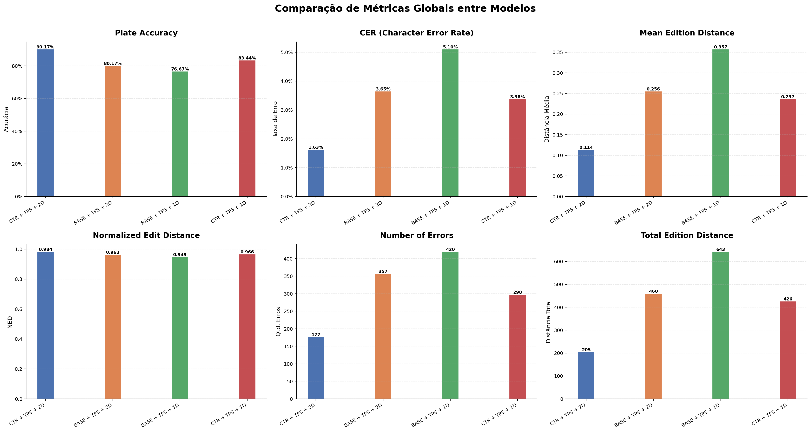
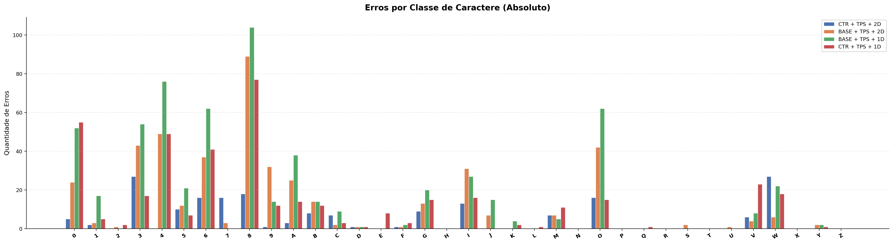
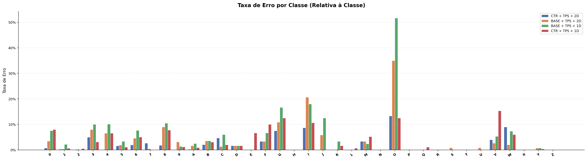
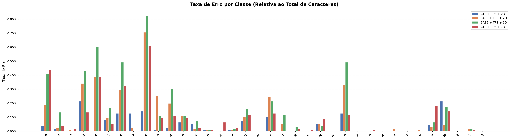
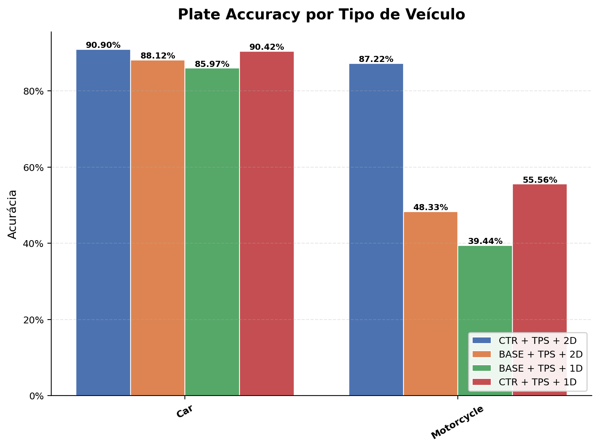
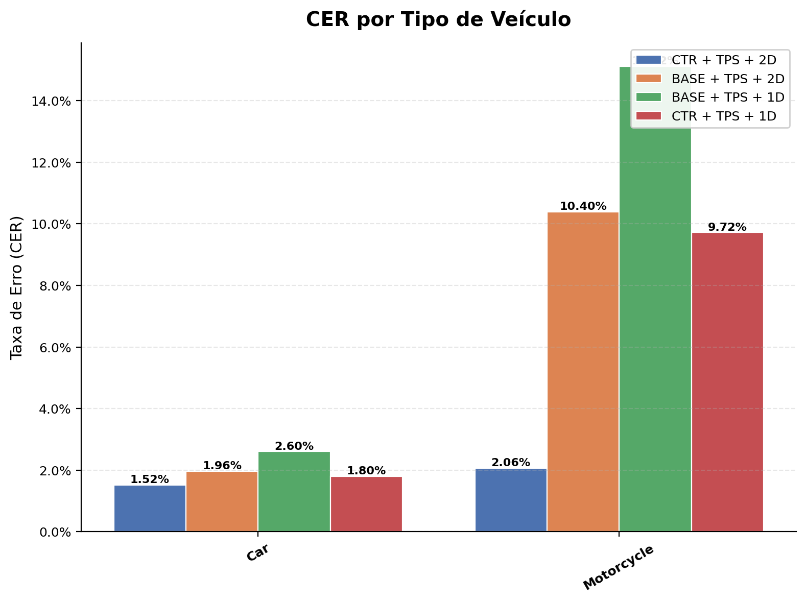
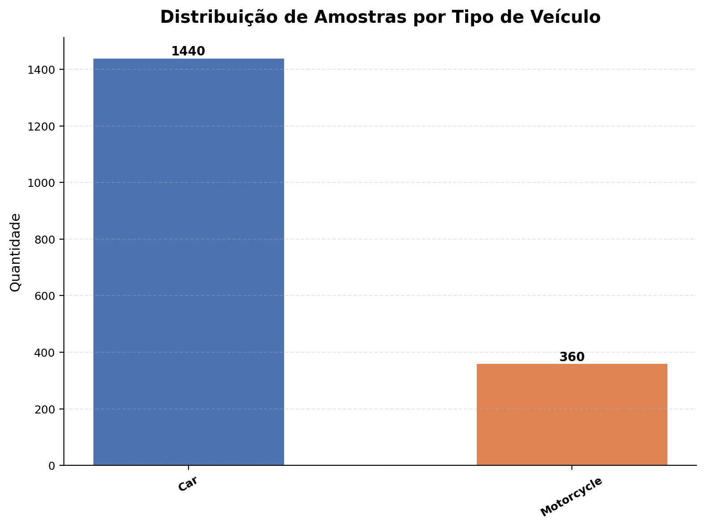

# 📊 Relatório Comparativo de Modelos

**Dataset**: `ufpr`  
**Data**: 2026-08-22 21:05:13  
**Modelos avaliados**: 4

---

## 🏷️ Modelos Avaliados

| # | Label | Run ID |
|---|-------|--------|
| 1 | **CTR + TPS + 2D** | `c614e91c1d8a45ec84ba7fc6db996d2e` |
| 2 | **BASE + TPS + 2D** | `1bb18edff9ab4710af1aa20dd2163199` |
| 3 | **BASE + TPS + 1D** | `54a3666a84b34c23a027e4a80ae7fb7e` |
| 4 | **CTR + TPS + 1D** | `7b9c2190df97432e9099dedcd13185d9` |

---

## ✅ Plate Accuracy

Proporção de placas reconhecidas corretamente (match exato).

| Modelo | Acertos | Erros | Total | Accuracy |
|--------|---------|-------|-------|----------|
| **CTR + TPS + 2D** | 1623 | 177 | 1800 | **90.1667%** |
| **BASE + TPS + 2D** | 1443 | 357 | 1800 | **80.1667%** |
| **BASE + TPS + 1D** | 1380 | 420 | 1800 | **76.6667%** |
| **CTR + TPS + 1D** | 1502 | 298 | 1800 | **83.4444%** |

> 🏆 **Melhor modelo**: CTR + TPS + 2D (90.1667%)

---

## 📉 CER (Character Error Rate)

Taxa de erro a nível de caractere (edit distance / total GT chars).

| Modelo | Edit Distance Total | Total GT Chars | CER |
|--------|---------------------|----------------|-----|
| **CTR + TPS + 2D** | 205 | 12600 | **1.6270%** |
| **BASE + TPS + 2D** | 460 | 12600 | **3.6508%** |
| **BASE + TPS + 1D** | 643 | 12600 | **5.1032%** |
| **CTR + TPS + 1D** | 426 | 12600 | **3.3810%** |

> 🏆 **Melhor modelo**: CTR + TPS + 2D (CER = 1.6270%)

---

## 📏 Edition Distance

Distância de edição Levenshtein entre predição e ground truth.

| Modelo | Total | Média | Normalized ED |
|--------|-------|-------|---------------|
| **CTR + TPS + 2D** | 205 | 0.1139 | 0.9837 |
| **BASE + TPS + 2D** | 460 | 0.2556 | 0.9635 |
| **BASE + TPS + 1D** | 643 | 0.3572 | 0.9490 |
| **CTR + TPS + 1D** | 426 | 0.2367 | 0.9662 |

> 🏆 **Melhor modelo**: CTR + TPS + 2D (Média = 0.1139)

---

## ❌ Number of Errors

Número de placas com pelo menos um caractere incorreto.

| Modelo | Erros | Total | Taxa de Erro |
|--------|-------|-------|--------------|
| **CTR + TPS + 2D** | 177 | 1800 | 9.8333% |
| **BASE + TPS + 2D** | 357 | 1800 | 19.8333% |
| **BASE + TPS + 1D** | 420 | 1800 | 23.3333% |
| **CTR + TPS + 1D** | 298 | 1800 | 16.5556% |

> 🏆 **Melhor modelo**: CTR + TPS + 2D (177 erros)

---

## 🔤 Erros por Classe de Caractere

Contagem absoluta de erros de reconhecimento por classe.

| Char | **CTR + TPS + 2D** | **BASE + TPS + 2D** | **BASE + TPS + 1D** | **CTR + TPS + 1D** |
|------|------|------|------|------|
| **0** | 5 | 24 | 52 | 55 |
| **1** | 2 | 3 | 17 | 5 |
| **2** | 0 | 1 | 0 | 2 |
| **3** | 27 | 43 | 54 | 17 |
| **4** | 0 | 49 | 76 | 49 |
| **5** | 10 | 12 | 21 | 7 |
| **6** | 16 | 37 | 62 | 41 |
| **7** | 16 | 3 | 0 | 0 |
| **8** | 18 | 89 | 104 | 77 |
| **9** | 1 | 32 | 14 | 12 |
| **A** | 3 | 25 | 38 | 14 |
| **B** | 8 | 14 | 14 | 12 |
| **C** | 7 | 2 | 9 | 3 |
| **D** | 1 | 1 | 1 | 1 |
| **E** | 0 | 0 | 0 | 8 |
| **F** | 1 | 1 | 2 | 3 |
| **G** | 9 | 13 | 20 | 15 |
| **H** | 0 | 0 | 0 | 0 |
| **I** | 13 | 31 | 27 | 16 |
| **J** | 0 | 7 | 15 | 0 |
| **K** | 0 | 0 | 4 | 2 |
| **L** | 0 | 0 | 0 | 1 |
| **M** | 7 | 7 | 5 | 11 |
| **N** | 0 | 0 | 0 | 0 |
| **O** | 16 | 42 | 62 | 15 |
| **P** | 0 | 0 | 0 | 0 |
| **Q** | 0 | 0 | 0 | 1 |
| **R** | 0 | 0 | 0 | 0 |
| **S** | 0 | 2 | 0 | 0 |
| **T** | 0 | 0 | 0 | 0 |
| **U** | 0 | 1 | 0 | 0 |
| **V** | 6 | 4 | 8 | 23 |
| **W** | 27 | 6 | 22 | 18 |
| **X** | 0 | 0 | 0 | 0 |
| **Y** | 0 | 2 | 2 | 1 |
| **Z** | 0 | 0 | 0 | 0 |

---

## 📊 Taxa de Erro por Classe (Relativa à Classe)

Proporção de caracteres incorretos em relação ao total de ocorrências da classe no GT.

| Char | **CTR + TPS + 2D** | **BASE + TPS + 2D** | **BASE + TPS + 1D** | **CTR + TPS + 1D** |
|------|------|------|------|------|
| **0** | 0.72% | 3.48% | 7.54% | 7.97% |
| **1** | 0.26% | 0.38% | 2.18% | 0.64% |
| **2** | 0.00% | 0.26% | 0.00% | 0.51% |
| **3** | 5.00% | 7.96% | 10.00% | 3.15% |
| **4** | 0.00% | 6.53% | 10.13% | 6.53% |
| **5** | 1.59% | 1.90% | 3.33% | 1.11% |
| **6** | 1.98% | 4.57% | 7.65% | 5.06% |
| **7** | 2.67% | 0.50% | 0.00% | 0.00% |
| **8** | 1.82% | 8.99% | 10.51% | 7.78% |
| **9** | 0.10% | 3.14% | 1.37% | 1.18% |
| **A** | 0.20% | 1.63% | 2.48% | 0.92% |
| **B** | 2.05% | 3.59% | 3.59% | 3.08% |
| **C** | 4.67% | 1.33% | 6.00% | 2.00% |
| **D** | 1.67% | 1.67% | 1.67% | 1.67% |
| **E** | 0.00% | 0.00% | 0.00% | 6.67% |
| **F** | 3.33% | 3.33% | 6.67% | 10.00% |
| **G** | 7.50% | 10.83% | 16.67% | 12.50% |
| **H** | 0.00% | 0.00% | 0.00% | 0.00% |
| **I** | 8.67% | 20.67% | 18.00% | 10.67% |
| **J** | 0.00% | 5.83% | 12.50% | 0.00% |
| **K** | 0.00% | 0.00% | 3.33% | 1.67% |
| **L** | 0.00% | 0.00% | 0.00% | 0.67% |
| **M** | 3.33% | 3.33% | 2.38% | 5.24% |
| **N** | 0.00% | 0.00% | 0.00% | 0.00% |
| **O** | 13.33% | 35.00% | 51.67% | 12.50% |
| **P** | 0.00% | 0.00% | 0.00% | 0.00% |
| **Q** | 0.00% | 0.00% | 0.00% | 1.11% |
| **R** | 0.00% | 0.00% | 0.00% | 0.00% |
| **S** | 0.00% | 0.83% | 0.00% | 0.00% |
| **T** | 0.00% | 0.00% | 0.00% | 0.00% |
| **U** | 0.00% | 0.83% | 0.00% | 0.00% |
| **V** | 4.00% | 2.67% | 5.33% | 15.33% |
| **W** | 9.00% | 2.00% | 7.33% | 6.00% |
| **X** | 0.00% | 0.00% | 0.00% | 0.00% |
| **Y** | 0.00% | 0.74% | 0.74% | 0.37% |
| **Z** | 0.00% | 0.00% | 0.00% | 0.00% |

---

## 📊 Taxa de Erro por Classe (Relativa ao Total de Caracteres)

Proporção de erros da classe em relação ao total de caracteres do GT.

| Char | **CTR + TPS + 2D** | **BASE + TPS + 2D** | **BASE + TPS + 1D** | **CTR + TPS + 1D** |
|------|------|------|------|------|
| **0** | 0.0397% | 0.1905% | 0.4127% | 0.4365% |
| **1** | 0.0159% | 0.0238% | 0.1349% | 0.0397% |
| **2** | 0.0000% | 0.0079% | 0.0000% | 0.0159% |
| **3** | 0.2143% | 0.3413% | 0.4286% | 0.1349% |
| **4** | 0.0000% | 0.3889% | 0.6032% | 0.3889% |
| **5** | 0.0794% | 0.0952% | 0.1667% | 0.0556% |
| **6** | 0.1270% | 0.2937% | 0.4921% | 0.3254% |
| **7** | 0.1270% | 0.0238% | 0.0000% | 0.0000% |
| **8** | 0.1429% | 0.7063% | 0.8254% | 0.6111% |
| **9** | 0.0079% | 0.2540% | 0.1111% | 0.0952% |
| **A** | 0.0238% | 0.1984% | 0.3016% | 0.1111% |
| **B** | 0.0635% | 0.1111% | 0.1111% | 0.0952% |
| **C** | 0.0556% | 0.0159% | 0.0714% | 0.0238% |
| **D** | 0.0079% | 0.0079% | 0.0079% | 0.0079% |
| **E** | 0.0000% | 0.0000% | 0.0000% | 0.0635% |
| **F** | 0.0079% | 0.0079% | 0.0159% | 0.0238% |
| **G** | 0.0714% | 0.1032% | 0.1587% | 0.1190% |
| **H** | 0.0000% | 0.0000% | 0.0000% | 0.0000% |
| **I** | 0.1032% | 0.2460% | 0.2143% | 0.1270% |
| **J** | 0.0000% | 0.0556% | 0.1190% | 0.0000% |
| **K** | 0.0000% | 0.0000% | 0.0317% | 0.0159% |
| **L** | 0.0000% | 0.0000% | 0.0000% | 0.0079% |
| **M** | 0.0556% | 0.0556% | 0.0397% | 0.0873% |
| **N** | 0.0000% | 0.0000% | 0.0000% | 0.0000% |
| **O** | 0.1270% | 0.3333% | 0.4921% | 0.1190% |
| **P** | 0.0000% | 0.0000% | 0.0000% | 0.0000% |
| **Q** | 0.0000% | 0.0000% | 0.0000% | 0.0079% |
| **R** | 0.0000% | 0.0000% | 0.0000% | 0.0000% |
| **S** | 0.0000% | 0.0159% | 0.0000% | 0.0000% |
| **T** | 0.0000% | 0.0000% | 0.0000% | 0.0000% |
| **U** | 0.0000% | 0.0079% | 0.0000% | 0.0000% |
| **V** | 0.0476% | 0.0317% | 0.0635% | 0.1825% |
| **W** | 0.2143% | 0.0476% | 0.1746% | 0.1429% |
| **X** | 0.0000% | 0.0000% | 0.0000% | 0.0000% |
| **Y** | 0.0000% | 0.0159% | 0.0159% | 0.0079% |
| **Z** | 0.0000% | 0.0000% | 0.0000% | 0.0000% |

---

## 🏅 Resumo Geral

| Métrica | Melhor Modelo | Valor |
|---------|---------------|-------|
| Plate Accuracy | **CTR + TPS + 2D** | 90.1667% |
| CER | **CTR + TPS + 2D** | 1.6270% |
| Mean Edit Distance | **CTR + TPS + 2D** | 0.1139 |
| Normalized ED | **CTR + TPS + 2D** | 0.9837 |
| N. Erros | **CTR + TPS + 2D** | 177 |

---

## 🚗 Análise por Tipo de Veículo

Acurácia e métricas discriminadas por tipo de veículo (mapeamento: `dataset/vehicle_mapping.csv`).

### Plate Accuracy por Tipo de Veículo

| Modelo |**Car** | **Motorcycle** |
|--------|--------|--------|
| **CTR + TPS + 2D** | 90.9028% (1309/1440) | 87.2222% (314/360) |
| **BASE + TPS + 2D** | 88.1250% (1269/1440) | 48.3333% (174/360) |
| **BASE + TPS + 1D** | 85.9722% (1238/1440) | 39.4444% (142/360) |
| **CTR + TPS + 1D** | 90.4167% (1302/1440) | 55.5556% (200/360) |

### CER por Tipo de Veículo

| Modelo |**Car** | **Motorcycle** |
|--------|--------|--------|
| **CTR + TPS + 2D** | 1.5179% | 2.0635% |
| **BASE + TPS + 2D** | 1.9643% | 10.3968% |
| **BASE + TPS + 1D** | 2.5992% | 15.1190% |
| **CTR + TPS + 1D** | 1.7956% | 9.7222% |

### Detalhamento por Tipo de Veículo

#### Car

| Modelo | Acertos | Erros | Total | Accuracy | CER | MED | NED |
|--------|---------|-------|-------|----------|-----|-----|-----|
| **CTR + TPS + 2D** | 1309 | 131 | 1440 | **90.9028%** | 1.5179% | 0.1062 | 0.9848 |
| **BASE + TPS + 2D** | 1269 | 171 | 1440 | **88.1250%** | 1.9643% | 0.1375 | 0.9804 |
| **BASE + TPS + 1D** | 1238 | 202 | 1440 | **85.9722%** | 2.5992% | 0.1819 | 0.9740 |
| **CTR + TPS + 1D** | 1302 | 138 | 1440 | **90.4167%** | 1.7956% | 0.1257 | 0.9820 |

#### Motorcycle

| Modelo | Acertos | Erros | Total | Accuracy | CER | MED | NED |
|--------|---------|-------|-------|----------|-----|-----|-----|
| **CTR + TPS + 2D** | 314 | 46 | 360 | **87.2222%** | 2.0635% | 0.1444 | 0.9794 |
| **BASE + TPS + 2D** | 174 | 186 | 360 | **48.3333%** | 10.3968% | 0.7278 | 0.8960 |
| **BASE + TPS + 1D** | 142 | 218 | 360 | **39.4444%** | 15.1190% | 1.0583 | 0.8488 |
| **CTR + TPS + 1D** | 200 | 160 | 360 | **55.5556%** | 9.7222% | 0.6806 | 0.9028 |

### 🏆 Melhor Modelo por Tipo de Veículo

| Tipo | Melhor Modelo | Accuracy |
|------|---------------|----------|
| **Car** | **CTR + TPS + 2D** | 90.9028% |
| **Motorcycle** | **CTR + TPS + 2D** | 87.2222% |

---

## 📈 Gráficos

### Métricas Globais

### Erros por Classe (Absoluto)

### Taxa de Erro por Classe (Relativa à Classe)

### Taxa de Erro por Classe (Relativa ao Total)

### Acurácia por Tipo de Veículo

### CER por Tipo de Veículo

### Distribuição de Amostras por Tipo de Veículo

